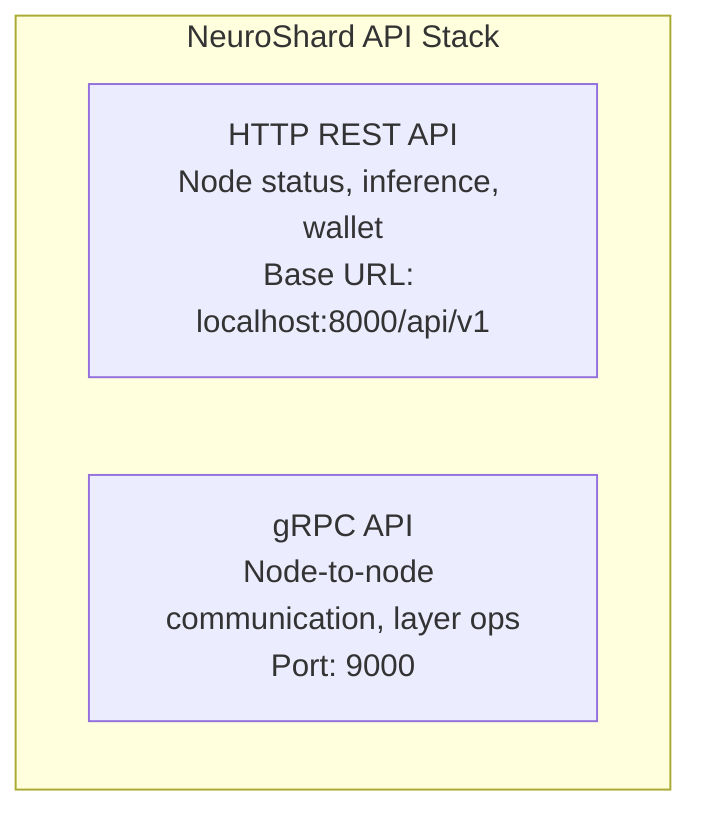

# API Reference

NeuroShard provides multiple interfaces for interacting with nodes and the network.

## API Types



::: info Port Configuration
The default HTTP port is 8000. The gRPC port is always HTTP port + 1000 (so 9000 by default).
You can change the HTTP port with `--port`.
:::

## Quick Reference

### HTTP Endpoints

| Method | Endpoint | Description |
|--------|----------|-------------|
| GET | `/api/v1/status` | Node status |
| GET | `/api/v1/metrics` | Performance metrics |
| POST | `/api/v1/inference` | Submit inference request |
| GET | `/api/v1/wallet/balance` | Get NEURO balance |
| POST | `/api/v1/wallet/send` | Send NEURO |
| GET | `/api/v1/peers` | List connected peers |
| GET | `/api/v1/layers` | List assigned layers |

### gRPC Services

| Service | Method | Description |
|---------|--------|-------------|
| NeuroShard | Forward | Layer forward pass |
| NeuroShard | Backward | Layer backward pass |
| NeuroShard | ExchangeGradient | DiLoCo gradient sync |
| NeuroShard | GetCheckpoint | Download checkpoint |
| NeuroShard | PutCheckpoint | Upload checkpoint |
| NeuroShard | Ping | Health check |

## Authentication

### API Token

Most endpoints require authentication via API token. The token is the same as your wallet token used to start the node:

```bash
# Use in requests
curl -H "Authorization: Bearer YOUR_TOKEN" \
     http://localhost:8000/api/v1/status
```

### Token in Headers

```python
import requests

headers = {
    "Authorization": f"Bearer {api_token}",
    "Content-Type": "application/json"
}

response = requests.get(
    "http://localhost:8000/api/v1/status",
    headers=headers
)
```

## Rate Limits

| Endpoint Type | Limit | Window |
|--------------|-------|--------|
| Status/Metrics | 100 | 1 minute |
| Inference | 60 | 1 minute |
| Wallet Operations | 10 | 1 minute |

## Error Responses

All errors follow this format:

```json
{
  "error": {
    "code": "INSUFFICIENT_BALANCE",
    "message": "Wallet balance 50.0 NEURO is less than required 100.0 NEURO",
    "details": {
      "balance": 50.0,
      "required": 100.0
    }
  }
}
```

### Error Codes

| Code | HTTP Status | Description |
|------|-------------|-------------|
| `UNAUTHORIZED` | 401 | Invalid or missing API token |
| `FORBIDDEN` | 403 | Insufficient permissions |
| `NOT_FOUND` | 404 | Resource not found |
| `RATE_LIMITED` | 429 | Too many requests |
| `INSUFFICIENT_BALANCE` | 402 | Not enough NEURO |
| `INVALID_REQUEST` | 400 | Malformed request |
| `INTERNAL_ERROR` | 500 | Server error |

## SDK Options

### Python SDK

```bash
pip install nexaroa
```

```python
from neuroshard import NeuroNode, NEUROLedger

# Connect to local node
node = NeuroNode("http://localhost:8000", api_token="YOUR_TOKEN")

# Check status
status = node.get_status()
print(f"Node: {status.node_id}")
print(f"Role: {status.role}")
print(f"Layers: {status.layers}")
print(f"Peers: {status.peer_count}")

# Run inference
response = node.inference("What is NeuroShard?", max_tokens=100)
print(response.text)

# Check balance
ledger = NEUROLedger(node)
balance = ledger.get_balance()
print(f"Balance: {balance.available} NEURO")
```

### JavaScript SDK (Coming Soon)

```javascript
import { NeuroNode } from '@neuroshard/sdk';

const node = new NeuroNode({
  url: 'http://localhost:8000',
  token: 'YOUR_TOKEN'
});

const status = await node.getStatus();
console.log(`Node: ${status.nodeId}`);
```

### CLI

The CLI is used to run a node. For programmatic access, use the SDK or REST API.

```bash
# Start a node
neuroshard --token YOUR_TOKEN

# Start on custom port
neuroshard --token YOUR_TOKEN --port 9000
```

## Next Steps

- [HTTP Endpoints](/api/http-endpoints) — REST API details
- [gRPC Services](/api/grpc-services) — gRPC protocol
- [Python SDK](/api/python-sdk) — Python client library
