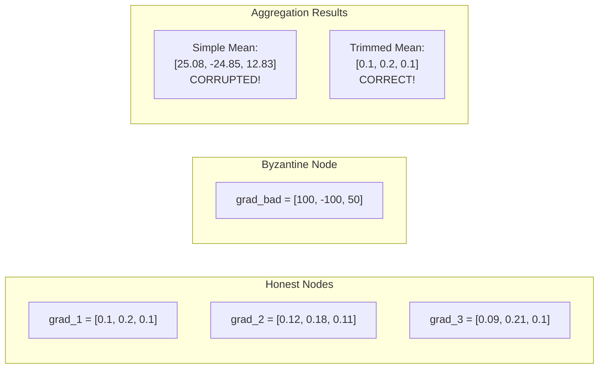

# Byzantine-Robust Aggregation

NeuroShard uses robust gradient aggregation to protect against malicious nodes that may submit incorrect or adversarial gradients.

## The Byzantine Problem

In a decentralized network, some nodes may be:

- **Malicious**: Intentionally submit bad gradients to corrupt training
- **Faulty**: Hardware errors causing incorrect computations
- **Byzantine**: Exhibit arbitrary, unpredictable behavior



## Aggregation Strategies

### 1. Simple Mean

```python
def mean_aggregate(gradients: List[Tensor]) -> Tensor:
    """Simple average of all gradients."""
    return torch.stack(gradients).mean(dim=0)
```

**Properties**:
- Fast O(n)
- Optimal when all nodes honest
- One bad gradient corrupts result
- **Use when**: Trusted/permissioned network

### 2. Median

```python
def median_aggregate(gradients: List[Tensor]) -> Tensor:
    """Element-wise median."""
    return torch.stack(gradients).median(dim=0).values
```

**Properties**:
- Robust to up to 50% Byzantine nodes
- No hyperparameters
- Higher variance than mean
- **Use when**: High Byzantine fraction expected

### 3. Trimmed Mean

```python
def trimmed_mean_aggregate(
    gradients: List[Tensor],
    trim_fraction: float = 0.2
) -> Tensor:
    """
    Remove top and bottom trim_fraction, then average.
    
    Default: Remove top 20% and bottom 20%.
    """
    stacked = torch.stack(gradients)
    n = len(gradients)
    k = int(n * trim_fraction)
    
    # Sort along peer dimension
    sorted_grads, _ = torch.sort(stacked, dim=0)
    
    # Remove top k and bottom k
    trimmed = sorted_grads[k:n-k]
    
    return trimmed.mean(dim=0)
```

**Properties**:
- Robust to up to `trim_fraction` Byzantine nodes
- Lower variance than median
- Requires enough peers (n > 2k)
- **Use when**: Default choice for NeuroShard

### 4. Krum

```python
def krum_aggregate(gradients: List[Tensor], f: int) -> Tensor:
    """
    Select gradient closest to other gradients.
    
    Args:
        gradients: List of gradients from peers
        f: Maximum number of Byzantine nodes
    """
    n = len(gradients)
    
    # Compute pairwise distances
    distances = torch.zeros(n, n)
    for i in range(n):
        for j in range(i+1, n):
            d = torch.norm(gradients[i] - gradients[j])
            distances[i, j] = d
            distances[j, i] = d
    
    # For each gradient, sum distances to n-f-2 closest neighbors
    scores = []
    for i in range(n):
        sorted_dists = torch.sort(distances[i])[0]
        score = sorted_dists[1:n-f-1].sum()  # Exclude self
        scores.append(score)
    
    # Select gradient with lowest score
    best_idx = torch.argmin(torch.tensor(scores))
    return gradients[best_idx]
```

**Properties**:
- Provably robust to f Byzantine nodes
- Selects actual gradient (not synthetic)
- O(n^2) complexity
- Only uses one gradient (high variance)
- **Use when**: Need provable guarantees

### 5. Multi-Krum

```python
def multi_krum_aggregate(
    gradients: List[Tensor],
    f: int,
    m: int = None
) -> Tensor:
    """
    Select and average m best gradients.
    
    Args:
        gradients: List of gradients from peers
        f: Maximum number of Byzantine nodes
        m: Number of gradients to average (default: n-f)
    """
    n = len(gradients)
    m = m or (n - f)
    
    # Compute scores like Krum
    scores = _compute_krum_scores(gradients, f)
    
    # Select m best
    best_indices = torch.argsort(torch.tensor(scores))[:m]
    selected = [gradients[i] for i in best_indices]
    
    return torch.stack(selected).mean(dim=0)
```

**Properties**:
- Robust like Krum
- Lower variance than Krum
- O(n^2) complexity
- **Use when**: Need robustness + lower variance

### 6. Geometric Median

```python
def geometric_median_aggregate(
    gradients: List[Tensor],
    max_iter: int = 100,
    tol: float = 1e-5
) -> Tensor:
    """
    Find point minimizing sum of distances to all gradients.
    
    Uses Weiszfeld's algorithm.
    """
    # Initialize with arithmetic mean
    median = torch.stack(gradients).mean(dim=0)
    
    for _ in range(max_iter):
        # Compute weights (inverse distances)
        distances = [torch.norm(g - median) for g in gradients]
        weights = [1.0 / (d + 1e-8) for d in distances]
        total_weight = sum(weights)
        
        # Update median
        new_median = sum(w * g for w, g in zip(weights, gradients)) / total_weight
        
        # Check convergence
        if torch.norm(new_median - median) < tol:
            break
        
        median = new_median
    
    return median
```

**Properties**:
- Robust to up to 50% Byzantine nodes
- Optimal breakdown point
- Iterative (slower)
- **Use when**: Maximum robustness needed

## Gradient Validator

Before aggregation, gradients are validated:

```python
class GradientValidator:
    """Validate gradients before aggregation."""
    
    def __init__(
        self,
        max_norm: float = 10.0,
        max_magnitude: float = 100.0,
        min_cosine_similarity: float = -0.5
    ):
        self.max_norm = max_norm
        self.max_magnitude = max_magnitude
        self.min_cosine_similarity = min_cosine_similarity

    def validate(
        self,
        gradient: Dict[str, Tensor],
        reference: Optional[Dict[str, Tensor]] = None
    ) -> Tuple[bool, str]:
        """
        Validate a gradient submission.
        
        Returns:
            (is_valid, reason)
        """
        # Check 1: Norm bound
        total_norm = 0.0
        for tensor in gradient.values():
            total_norm += tensor.norm().item() ** 2
        total_norm = total_norm ** 0.5
        
        if total_norm > self.max_norm:
            return False, f"Gradient norm {total_norm:.2f} exceeds max {self.max_norm}"
        
        # Check 2: Element magnitude
        for name, tensor in gradient.items():
            max_val = tensor.abs().max().item()
            if max_val > self.max_magnitude:
                return False, f"Element in {name} exceeds max magnitude"
        
        # Check 3: Cosine similarity to reference
        if reference is not None:
            cos_sim = self._cosine_similarity(gradient, reference)
            if cos_sim < self.min_cosine_similarity:
                return False, f"Cosine similarity {cos_sim:.2f} too low"
        
        # Check 4: NaN/Inf check
        for name, tensor in gradient.items():
            if torch.isnan(tensor).any() or torch.isinf(tensor).any():
                return False, f"NaN or Inf in {name}"
        
        return True, "Valid"

    def _cosine_similarity(
        self,
        grad1: Dict[str, Tensor],
        grad2: Dict[str, Tensor]
    ) -> float:
        """Compute cosine similarity between gradients."""
        flat1 = torch.cat([g.flatten() for g in grad1.values()])
        flat2 = torch.cat([g.flatten() for g in grad2.values()])
        return F.cosine_similarity(flat1, flat2, dim=0).item()
```

## RobustAggregator

Complete aggregator with validation:

```python
class RobustAggregator:
    """Byzantine-robust gradient aggregation."""
    
    def __init__(
        self,
        strategy: str = "trimmed_mean",
        byzantine_fraction: float = 0.2,
        validator: Optional[GradientValidator] = None
    ):
        self.strategy = strategy
        self.byzantine_fraction = byzantine_fraction
        self.validator = validator or GradientValidator()
        
        # Strategy mapping
        self.strategies = {
            "mean": self._mean,
            "median": self._median,
            "trimmed_mean": self._trimmed_mean,
            "krum": self._krum,
            "multi_krum": self._multi_krum,
            "geometric_median": self._geometric_median,
        }

    def aggregate(
        self,
        gradients: List[Dict[str, Tensor]],
        node_ids: Optional[List[str]] = None
    ) -> Dict[str, Tensor]:
        """
        Aggregate gradients from multiple peers.
        
        1. Validate all gradients
        2. Filter invalid ones
        3. Apply robust aggregation
        """
        # Step 1: Validate
        valid_grads = []
        valid_ids = []
        reference = self._compute_reference(gradients)
        
        for i, grad in enumerate(gradients):
            is_valid, reason = self.validator.validate(grad, reference)
            if is_valid:
                valid_grads.append(grad)
                if node_ids:
                    valid_ids.append(node_ids[i])
            else:
                logger.warning(f"Rejected gradient from {node_ids[i] if node_ids else i}: {reason}")
        
        if len(valid_grads) < 3:
            raise ValueError(f"Not enough valid gradients: {len(valid_grads)}")
        
        # Step 2: Aggregate per parameter
        result = {}
        for name in valid_grads[0].keys():
            tensors = [g[name] for g in valid_grads]
            result[name] = self.strategies[self.strategy](tensors)
        
        return result
```

## Comparison

| Method | Byzantine Tolerance | Variance | Complexity | Default |
|--------|-------------------|----------|------------|---------|
| Mean | 0% | Low | O(n) | No |
| Median | 50% | High | O(n log n) | No |
| Trimmed Mean | 20% | Low | O(n log n) | **Yes** |
| Krum | f/(2f+3) | Very High | O(n^2) | No |
| Multi-Krum | f/(2f+3) | Medium | O(n^2) | No |
| Geometric Median | 50% | Low | O(n x iter) | No |

## Configuration

```python
# Aggregation parameters (constants.py)
DEFAULT_AGGREGATION = "trimmed_mean"
BYZANTINE_FRACTION = 0.2           # Assume up to 20% Byzantine
MAX_GRADIENT_NORM = 10.0           # Clip gradients
MAX_ELEMENT_MAGNITUDE = 100.0      # Element-wise bound
MIN_COSINE_SIMILARITY = -0.5       # Reject anti-correlated gradients
MIN_PEERS_FOR_AGGREGATION = 3      # Minimum peers needed
```

## Attack Resistance

### Gradient Scaling Attack

**Attack**: Submit gradients with very large magnitude

```python
# Attacker submits:
bad_grad = honest_grad * 1000
```

**Defense**: Gradient norm validation + trimmed mean

### Gradient Reversal Attack

**Attack**: Submit negative of true gradient

```python
# Attacker submits:
bad_grad = -honest_grad
```

**Defense**: Cosine similarity check rejects anti-correlated gradients

### Sybil Attack

**Attack**: Create many fake identities to dominate aggregation

**Defense**: 
- Proof of Neural Work requires actual computation
- Staking requirements for validators
- Reputation system tracks contribution history

### Collusion Attack

**Attack**: Multiple Byzantine nodes coordinate

**Defense**:
- Trimmed mean still works if collusion < trim fraction
- Validators check for suspiciously similar gradients
- Economic penalties (slashing) deter coordination

## Monitoring

Track these metrics for aggregation health:

```python
# Per-aggregation metrics
num_valid_gradients: int       # Gradients that passed validation
num_rejected_gradients: int    # Gradients that failed validation
rejection_reasons: Counter     # Why gradients were rejected

# Gradient statistics
mean_gradient_norm: float      # Average gradient magnitude
gradient_norm_std: float       # Variance in norms (high = suspicious)
mean_cosine_similarity: float  # Agreement between peers

# Byzantine detection
outlier_count: int             # Gradients trimmed/rejected
suspected_byzantine: Set[str]  # Nodes with repeated rejections
```

## Next Steps

- [Mathematical Foundations](/architecture/mathematical-foundations) — Formal proofs and derivations
- [P2P Network](/architecture/p2p-network) — Network layer
- [Proof of Neural Work](/guide/proof-of-neural-work) — PoNW verification
- [Token Economics](/economics/overview) — Incentive alignment
