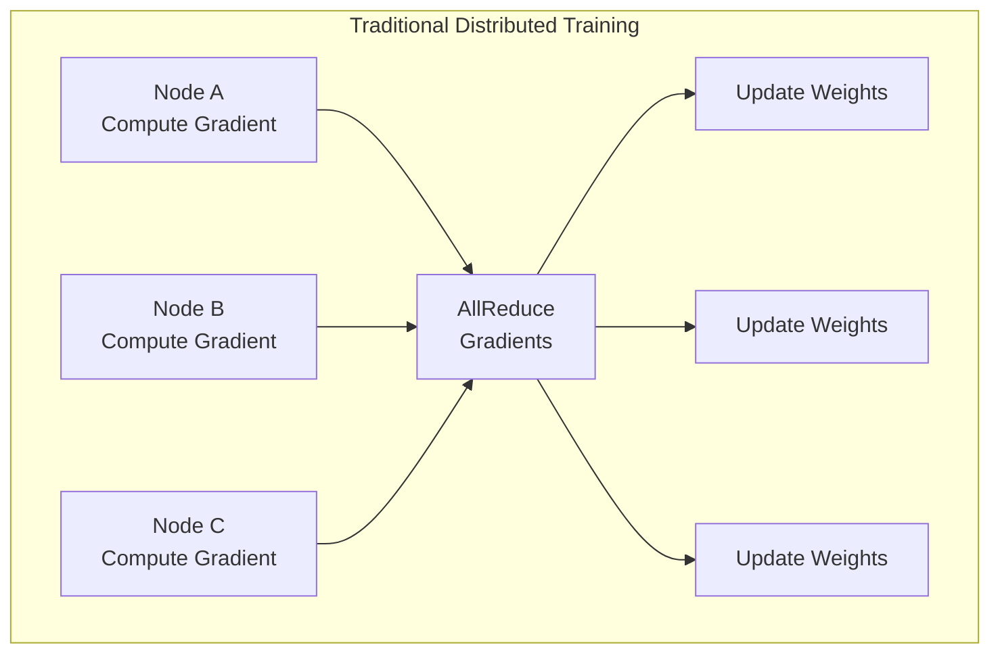
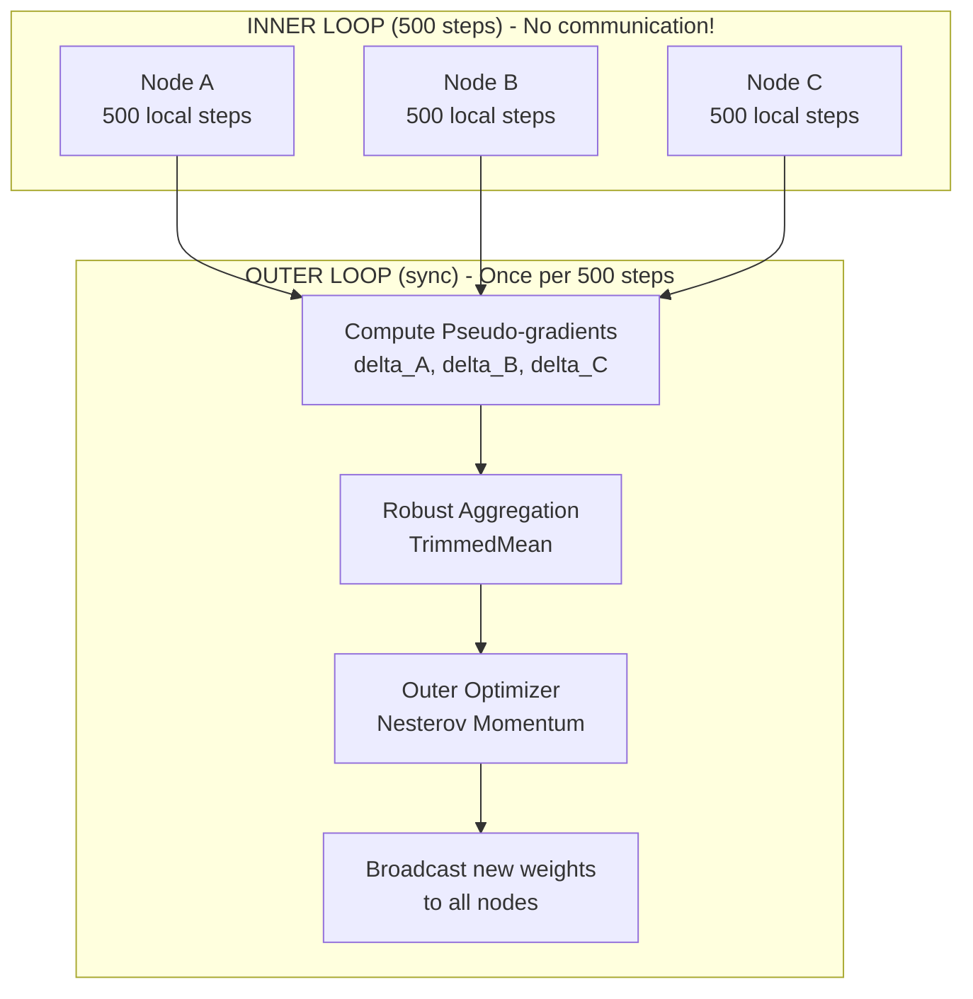
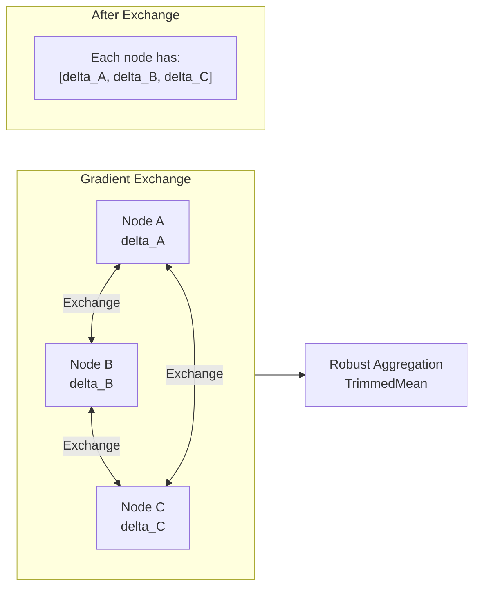

# DiLoCo Protocol

DiLoCo (Distributed Low-Communication training) is the core training protocol that enables efficient distributed learning across high-latency networks.

## The Problem

Traditional distributed training requires gradient synchronization after every batch:



**Problems**:
- Synchronization every ~100ms on WAN
- Network becomes bottleneck
- Cannot scale beyond ~100 nodes efficiently

## The DiLoCo Solution

DiLoCo reduces communication by 500x:



## Implementation

### DiLoCoTrainer

```python
class DiLoCoTrainer:
    """
    Distributed Low-Communication Training.
    
    Based on: https://arxiv.org/abs/2311.08105
    """
    
    def __init__(
        self,
        model: nn.Module,
        inner_optimizer: torch.optim.Optimizer,
        inner_steps: int = 500,
        outer_lr: float = 0.1,
        outer_momentum: float = 0.9,
    ):
        self.model = model
        self.inner_optimizer = inner_optimizer
        self.inner_steps = inner_steps
        
        # Outer optimizer with Nesterov momentum
        self.outer_optimizer = OuterOptimizer(
            params=model.parameters(),
            lr=outer_lr,
            momentum=outer_momentum,
            nesterov=True
        )
        
        # Save initial weights for pseudo-gradient computation
        self.initial_weights = self._snapshot_weights()
        self.step_count = 0

    def _snapshot_weights(self) -> Dict[str, torch.Tensor]:
        """Save copy of current weights."""
        return {
            name: param.data.clone()
            for name, param in self.model.named_parameters()
        }

    def train_step(self, batch: Dict[str, torch.Tensor]) -> float:
        """Execute one inner training step."""
        self.model.train()
        
        # Forward pass
        outputs = self.model(**batch)
        loss = outputs.loss
        
        # Backward pass
        loss.backward()
        self.inner_optimizer.step()
        self.inner_optimizer.zero_grad()
        
        self.step_count += 1
        
        return loss.item()

    def should_sync(self) -> bool:
        """Check if we should synchronize with peers."""
        return self.step_count >= self.inner_steps

    def compute_pseudo_gradient(self) -> Dict[str, torch.Tensor]:
        """
        Compute pseudo-gradient: difference between current and initial weights.
        
        delta = current - initial
        """
        pseudo_grad = {}
        for name, param in self.model.named_parameters():
            pseudo_grad[name] = param.data - self.initial_weights[name]
        return pseudo_grad

    async def sync_with_peers(
        self,
        aggregator: RobustAggregator,
        peers: List[PeerConnection]
    ) -> None:
        """
        Synchronize with peers via gossip protocol.
        
        1. Compute local pseudo-gradient
        2. Exchange with peers
        3. Aggregate robustly
        4. Apply outer optimizer update
        5. Reset for next inner loop
        """
        # Step 1: Compute local pseudo-gradient
        local_pseudo_grad = self.compute_pseudo_gradient()
        
        # Step 2: Exchange with peers
        all_pseudo_grads = [local_pseudo_grad]
        for peer in peers:
            try:
                peer_grad = await peer.exchange_gradients(local_pseudo_grad)
                all_pseudo_grads.append(peer_grad)
            except Exception as e:
                logger.warning(f"Failed to get gradients from {peer.id}: {e}")
        
        # Step 3: Aggregate robustly (Byzantine-tolerant)
        aggregated = {}
        for name in local_pseudo_grad.keys():
            grads = [pg[name] for pg in all_pseudo_grads]
            aggregated[name] = aggregator.aggregate(grads)
        
        # Step 4: Apply outer optimizer update
        self.outer_optimizer.step(aggregated)
        
        # Step 5: Reset for next inner loop
        self.initial_weights = self._snapshot_weights()
        self.step_count = 0
```

### Outer Optimizer

```python
class OuterOptimizer:
    """
    Nesterov momentum optimizer for outer loop.
    
    Uses pseudo-gradients instead of true gradients.
    """
    
    def __init__(
        self,
        params: Iterator[nn.Parameter],
        lr: float = 0.1,
        momentum: float = 0.9,
        nesterov: bool = True
    ):
        self.params = list(params)
        self.lr = lr
        self.momentum = momentum
        self.nesterov = nesterov
        
        # Momentum buffer
        self.velocity = {
            id(p): torch.zeros_like(p.data)
            for p in self.params
        }

    def step(self, pseudo_gradients: Dict[str, torch.Tensor]) -> None:
        """Apply outer update with Nesterov momentum."""
        with torch.no_grad():
            for param, (name, grad) in zip(self.params, pseudo_gradients.items()):
                v = self.velocity[id(param)]
                
                if self.nesterov:
                    # Nesterov momentum
                    v_prev = v.clone()
                    v.mul_(self.momentum).add_(grad, alpha=self.lr)
                    param.data.add_(v_prev, alpha=-self.momentum)
                    param.data.add_(v, alpha=-(1 + self.momentum))
                else:
                    # Standard momentum
                    v.mul_(self.momentum).add_(grad, alpha=self.lr)
                    param.data.add_(v, alpha=-1)
```

## Why DiLoCo Works

### Mathematical Foundation

The key insight is that the pseudo-gradient approximates the true gradient:

```
theta_{t+500} = theta_t - Sum_{i=0}^{499} lr * grad_L(theta_{t+i})  (500 SGD steps)

delta = theta_{t+500} - theta_t ~ -lr * 500 * E[grad_L]  (pseudo-gradient)
```

Over 500 steps, random noise averages out, leaving the "direction" of optimization.

### Convergence Guarantees

Under standard assumptions (Lipschitz gradients, bounded variance):

```
E[L(theta_T)] - L(theta*) <= O(1/sqrt(T x inner_steps))
```

Same asymptotic convergence as synchronous SGD, but with 500x less communication.

### Empirical Results

From the DiLoCo paper:
- 500 inner steps = 500x communication reduction
- Final loss within 1-2% of fully synchronous training
- Works for models up to 1B+ parameters
- Robust to heterogeneous compute (stragglers)

## Gradient Gossip Protocol

Efficient peer-to-peer gradient exchange:



### Implementation

```python
class GradientGossip:
    """Gossip protocol for pseudo-gradient exchange."""
    
    def __init__(self, node_id: str, peers: List[PeerInfo]):
        self.node_id = node_id
        self.peers = peers
        self.pending_grads: Dict[str, torch.Tensor] = {}

    async def gossip_round(
        self,
        local_grad: Dict[str, torch.Tensor]
    ) -> List[Dict[str, torch.Tensor]]:
        """
        Execute one gossip round.
        
        1. Send local gradient to all peers
        2. Receive gradients from all peers
        3. Return collected gradients
        """
        collected = [local_grad]
        
        # Parallel send/receive
        async with asyncio.TaskGroup() as tg:
            for peer in self.peers:
                tg.create_task(self._exchange_with_peer(peer, local_grad, collected))
        
        return collected

    async def _exchange_with_peer(
        self,
        peer: PeerInfo,
        local_grad: Dict[str, torch.Tensor],
        collected: List[Dict[str, torch.Tensor]]
    ) -> None:
        """Exchange gradients with one peer."""
        try:
            # Compress gradient for transmission
            compressed = self._compress(local_grad)
            
            # Send and receive
            response = await peer.rpc.exchange_gradient(
                gradient=compressed,
                node_id=self.node_id,
                round_id=self.current_round
            )
            
            # Decompress received gradient
            peer_grad = self._decompress(response.gradient)
            collected.append(peer_grad)
            
        except asyncio.TimeoutError:
            logger.warning(f"Timeout exchanging with {peer.id}")
        except Exception as e:
            logger.error(f"Error exchanging with {peer.id}: {e}")

    def _compress(self, grad: Dict[str, torch.Tensor]) -> bytes:
        """Compress gradient for transmission (Top-K sparsification)."""
        compressed = {}
        for name, tensor in grad.items():
            # Keep top 10% of values
            k = max(1, int(tensor.numel() * 0.1))
            values, indices = torch.topk(tensor.abs().flatten(), k)
            compressed[name] = (
                indices.cpu().numpy(),
                tensor.flatten()[indices].cpu().numpy()
            )
        return pickle.dumps(compressed)

    def _decompress(self, data: bytes) -> Dict[str, torch.Tensor]:
        """Decompress received gradient."""
        compressed = pickle.loads(data)
        grad = {}
        for name, (indices, values) in compressed.items():
            tensor = torch.zeros(self.shapes[name])
            tensor.flatten()[indices] = torch.from_numpy(values)
            grad[name] = tensor
        return grad
```

## Hyperparameters

### Inner Loop

| Parameter | Default | Range | Notes |
|-----------|---------|-------|-------|
| `inner_steps` | 500 | 100-1000 | More = less communication, potentially worse convergence |
| `inner_lr` | 1e-4 | 1e-5 to 1e-3 | Standard learning rate |
| `batch_size` | 8 | 1-32 | Per-node batch size |

### Outer Loop

| Parameter | Default | Range | Notes |
|-----------|---------|-------|-------|
| `outer_lr` | 0.1 | 0.01-0.5 | Learning rate for pseudo-gradients |
| `outer_momentum` | 0.9 | 0.8-0.99 | Nesterov momentum |
| `nesterov` | True | - | Always use Nesterov |

### Aggregation

| Parameter | Default | Range | Notes |
|-----------|---------|-------|-------|
| `aggregation` | `trimmed_mean` | - | Byzantine-robust method |
| `trim_fraction` | 0.2 | 0.1-0.3 | Fraction to trim from each end |
| `min_peers` | 3 | 2+ | Minimum peers for aggregation |

## DiLoCo vs. Other Methods

| Method | Communication | Byzantine Robust | Convergence |
|--------|--------------|------------------|-------------|
| Synchronous SGD | Every batch | No | Optimal |
| Async SGD | Every batch | No | Near-optimal |
| Federated Averaging | Every N batches | No | Good |
| **DiLoCo** | Every 500 batches | **Yes** | Near-optimal |

## Monitoring

Track these metrics for healthy DiLoCo training:

```python
# Inner loop metrics
inner_loss: float          # Loss per inner step
inner_grad_norm: float     # Gradient norm per step

# Outer loop metrics
pseudo_grad_norm: float    # Magnitude of pseudo-gradient
peer_grad_similarity: float  # Cosine similarity between peer gradients
aggregated_grad_norm: float  # Post-aggregation gradient norm

# Convergence metrics
loss_after_sync: float     # Loss immediately after outer update
weight_divergence: float   # Variance of weights across nodes
```

## Troubleshooting

### Divergence After Sync

**Symptoms**: Loss spikes after outer update

**Solutions**:
- Reduce `outer_lr` (try 0.05)
- Increase `inner_steps` (try 1000)
- Check for Byzantine nodes (examine gradient norms)

### Slow Convergence

**Symptoms**: Loss decreases very slowly

**Solutions**:
- Increase `inner_lr`
- Reduce `inner_steps` (try 250)
- Check peer connectivity (need 3+ peers)

### High Variance Between Nodes

**Symptoms**: Peer gradients have low cosine similarity

**Solutions**:
- Reduce `inner_steps`
- Use same data ordering (synchronized shuffling)
- Check for data imbalance between nodes

## Next Steps

- [Mathematical Foundations](/architecture/mathematical-foundations) — Complete mathematical treatment
- [Swarm Aggregation](/architecture/aggregation) — Byzantine-robust methods
- [P2P Network](/architecture/p2p-network) — Network layer
- [Token Economics](/economics/overview) — Reward system
