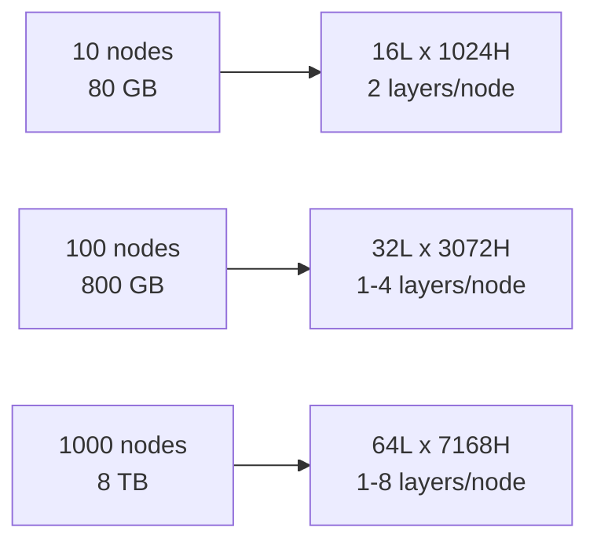
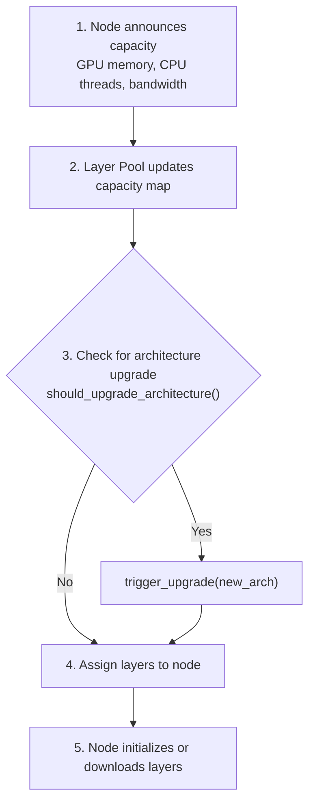

# Dynamic Scaling

NeuroShard's architecture grows organically as nodes join the network. This page explains the scaling algorithms and mechanics.

## Overview



## Architecture Tiers

| Tier | Memory Range | Layers | Hidden | Heads | Parameters |
|------|-------------|--------|--------|-------|------------|
| Nano | 0-40 GB | 8 | 512 | 4 | ~85M |
| Micro | 40-100 GB | 16 | 1024 | 8 | ~350M |
| Small | 100-400 GB | 24 | 2048 | 16 | ~2.2B |
| Medium | 400-1.6 TB | 32 | 3072 | 24 | ~9.2B |
| Large | 1.6-6 TB | 48 | 5120 | 40 | ~45B |
| XL | 6+ TB | 64 | 7168 | 56 | ~123B |

## Scaling Algorithm

### Step 1: Calculate Optimal Architecture

```python
def calculate_optimal_architecture(total_memory_gb: float) -> ModelArchitecture:
    """
    Determine model dimensions from total network memory.
    
    Args:
        total_memory_gb: Sum of all node memory capacities
        
    Returns:
        Optimal architecture for this capacity
    """
    # Minimum viable architecture
    if total_memory_gb < 10:
        return ModelArchitecture(
            num_layers=8,
            hidden_dim=512,
            num_heads=4,
            num_kv_heads=1,
            ffn_dim=2048
        )
    
    # Width scales as sqrt of memory (sub-linear for efficiency)
    hidden = int(256 * math.sqrt(total_memory_gb / 10))
    
    # Align to 64 for tensor core efficiency
    hidden = ((hidden + 63) // 64) * 64
    
    # Cap at maximum practical size
    hidden = min(hidden, 8192)
    
    # Depth scales logarithmically (diminishing returns)
    layers = min(64, max(8, int(8 * math.log2(total_memory_gb / 10 + 1))))
    
    # Make layers even for pipeline parallelism
    layers = (layers // 2) * 2
    
    # Heads scale with width
    heads = max(4, hidden // 128)
    
    # KV heads = 1/4 of Q heads (GQA ratio)
    kv_heads = max(1, heads // 4)
    
    return ModelArchitecture(
        num_layers=layers,
        hidden_dim=hidden,
        num_heads=heads,
        num_kv_heads=kv_heads,
        ffn_dim=hidden * 4
    )
```

### Step 2: Check Upgrade Threshold

```python
def should_upgrade_architecture(
    current: ModelArchitecture,
    total_memory_gb: float
) -> bool:
    """
    Determine if network should upgrade to larger architecture.
    
    Upgrades trigger when:
    1. Optimal architecture is larger than current
    2. Memory surplus exceeds 50% (hysteresis prevents oscillation)
    """
    optimal = calculate_optimal_architecture(total_memory_gb)
    
    # Need both more depth AND width for upgrade
    deeper = optimal.num_layers > current.num_layers
    wider = optimal.hidden_dim > current.hidden_dim
    
    if not (deeper or wider):
        return False
    
    # Compute memory surplus
    current_usage = estimate_model_memory(current)
    surplus = (total_memory_gb - current_usage) / current_usage
    
    # Require 50% surplus for upgrade (hysteresis)
    return surplus > 0.5
```

### Step 3: Redistribute Layers

```python
def calculate_layer_assignment(
    node_capacities: Dict[str, float],
    architecture: ModelArchitecture
) -> Dict[str, List[int]]:
    """
    Assign layers to nodes proportionally to their memory.
    
    Algorithm:
    1. Calculate memory per layer
    2. Assign layers proportionally to node capacity
    3. Ensure each layer has MIN_REPLICAS (2) for redundancy
    4. Balance load across nodes
    """
    memory_per_layer = estimate_memory_per_layer(architecture)
    total_memory = sum(node_capacities.values())
    
    assignments: Dict[str, List[int]] = defaultdict(list)
    layer_loads: Dict[int, int] = defaultdict(int)  # replicas per layer
    
    # Sort nodes by capacity (largest first for better distribution)
    sorted_nodes = sorted(
        node_capacities.items(), 
        key=lambda x: x[1], 
        reverse=True
    )
    
    for node_id, memory in sorted_nodes:
        # How many layers can this node hold?
        capacity = int(memory / memory_per_layer)
        
        # Find layers that need replicas
        for _ in range(capacity):
            # Pick layer with fewest replicas
            layer_idx = min(
                range(architecture.num_layers),
                key=lambda l: (layer_loads[l], l)  # tie-break by index
            )
            
            # Stop if all layers have enough replicas
            if layer_loads[layer_idx] >= MAX_REPLICAS:
                break
            
            assignments[node_id].append(layer_idx)
            layer_loads[layer_idx] += 1
    
    return dict(assignments)
```

## Node Registration Flow



## Architecture Upgrade Process

When the network grows enough to support a larger model:

```python
async def upgrade_architecture(new_arch: ModelArchitecture):
    """
    Upgrade network to new architecture.
    
    Strategy:
    1. Freeze training (DiLoCo outer sync point)
    2. Save current checkpoint
    3. Initialize new layers with interpolated weights
    4. Redistribute layers to nodes
    5. Resume training
    """
    # Step 1: Freeze training
    await broadcast_training_pause()
    
    # Step 2: Save checkpoint
    checkpoint = await collect_global_checkpoint()
    save_checkpoint(checkpoint, f"upgrade_{current_arch}_to_{new_arch}")
    
    # Step 3: Initialize new architecture
    new_weights = initialize_scaled_weights(
        old_weights=checkpoint,
        old_arch=current_arch,
        new_arch=new_arch
    )
    
    # Step 4: Redistribute layers
    new_assignments = calculate_layer_assignment(
        node_capacities,
        new_arch
    )
    
    for node_id, layers in new_assignments.items():
        await distribute_layers_to_node(node_id, layers, new_weights)
    
    # Step 5: Resume
    current_arch = new_arch
    await broadcast_training_resume()
```

### Weight Scaling

When upgrading to a larger architecture, weights are scaled:

```python
def initialize_scaled_weights(
    old_weights: Dict[str, Tensor],
    old_arch: ModelArchitecture,
    new_arch: ModelArchitecture
) -> Dict[str, Tensor]:
    """
    Scale weights from old to new architecture.
    
    Strategies:
    - Wider: Zero-pad new dimensions
    - Deeper: Interpolate or duplicate layers
    """
    new_weights = {}
    
    # Handle width increase
    width_scale = new_arch.hidden_dim / old_arch.hidden_dim
    
    for name, param in old_weights.items():
        if 'embed' in name or 'lm_head' in name:
            # Embedding/output: zero-pad hidden dimension
            new_weights[name] = zero_pad_hidden(param, new_arch.hidden_dim)
        elif 'layers' in name:
            layer_idx = extract_layer_idx(name)
            # Map old layer to new layer(s)
            new_idx = int(layer_idx * new_arch.num_layers / old_arch.num_layers)
            new_name = name.replace(f'layers.{layer_idx}', f'layers.{new_idx}')
            new_weights[new_name] = scale_layer_weights(param, width_scale)
        else:
            new_weights[name] = param
    
    return new_weights
```

## Layer Assignment Visualization

### Before Node Joins

```
Network: 3 nodes, 24 GB total, 8 layers

Node A (8GB):  [Layer 0, Layer 1, Layer 2]
Node B (8GB):  [Layer 2, Layer 3, Layer 4]  <- Layer 2 replica
Node C (8GB):  [Layer 5, Layer 6, Layer 7]
```

### After Node D Joins (16 GB)

```
Network: 4 nodes, 40 GB total, 16 layers (UPGRADED!)

Node A (8GB):  [Layer 0, Layer 1]
Node B (8GB):  [Layer 4, Layer 5]
Node C (8GB):  [Layer 6, Layer 7]
Node D (16GB): [Layer 2, Layer 3, Layer 8-11]
(Replicas distributed across nodes)
```

## Downgrade Handling

When nodes leave:

```python
async def handle_node_departure(node_id: str):
    """Handle node leaving the network."""
    # Remove from capacity map
    del node_capacities[node_id]
    
    # Check if we need to downgrade
    new_total = sum(node_capacities.values())
    
    if should_downgrade_architecture(current_arch, new_total):
        # Graceful downgrade with checkpoint save
        await downgrade_architecture(calculate_optimal_architecture(new_total))
    else:
        # Just redistribute orphaned layers
        orphaned_layers = layer_assignments[node_id]
        del layer_assignments[node_id]
        
        for layer_idx in orphaned_layers:
            # Find node with capacity
            target = find_node_with_capacity(layer_idx)
            if target:
                await assign_layer_to_node(target, layer_idx)
            else:
                logger.warning(f"Layer {layer_idx} under-replicated!")
```

## Memory Estimation

Accurate memory estimation is crucial:

```python
def estimate_memory_per_layer(arch: ModelArchitecture) -> float:
    """
    Estimate memory per transformer layer in GB.
    
    Includes:
    - Parameters (weights)
    - Gradients (during training)
    - Optimizer states (AdamW: 2x params)
    - Activations (batch-dependent)
    """
    h = arch.hidden_dim
    f = arch.ffn_dim
    heads = arch.num_heads
    kv_heads = arch.num_kv_heads
    head_dim = h // heads
    
    # Count parameters
    attn_params = (
        h * heads * head_dim +      # Q proj
        h * kv_heads * head_dim +   # K proj
        h * kv_heads * head_dim +   # V proj
        heads * head_dim * h        # O proj
    )
    
    ffn_params = (
        h * f +  # gate_proj
        h * f +  # up_proj
        f * h    # down_proj
    )
    
    norm_params = h * 2  # 2 RMSNorm layers
    
    total_params = attn_params + ffn_params + norm_params
    
    # Memory calculation:
    # - Parameters: 4 bytes (float32)
    # - Gradients: 4 bytes (during training)
    # - Optimizer: 8 bytes (AdamW momentum + variance)
    # Total: 16 bytes per parameter during training
    
    bytes_per_param = 16 if training else 4
    layer_bytes = total_params * bytes_per_param
    
    # Add activation memory (rough estimate)
    # ~2x parameter memory for typical batch sizes
    activation_overhead = 2.0 if training else 1.2
    
    return layer_bytes * activation_overhead / (1024 ** 3)


def estimate_model_memory(arch: ModelArchitecture) -> float:
    """Estimate total model memory in GB."""
    layer_mem = estimate_memory_per_layer(arch)
    
    # Embedding and LM head
    embed_params = arch.vocab_size * arch.hidden_dim * 2  # embed + lm_head
    embed_mem = embed_params * 4 / (1024 ** 3)
    
    return layer_mem * arch.num_layers + embed_mem
```

## Scaling Properties

### Compute Scaling

```
Parameters ~ hidden^2 x layers
FLOPS ~ batch x seq x hidden^2 x layers
Memory ~ hidden^2 x layers + batch x seq x hidden
```

### Network Scaling

```
Nodes:           N
Memory:          M = Sum of node_memory
Layers:          L = O(log M)
Hidden:          H = O(sqrt(M))
Params:          P = O(H^2 x L) = O(M x log M)
```

### Efficiency Bounds

| Nodes | Params/Node | Latency Overhead | Throughput |
|-------|-------------|------------------|------------|
| 10 | 35M | 2x | 10 tok/s |
| 100 | 92M | 3x | 50 tok/s |
| 1000 | 123M | 5x | 200 tok/s |

## Configuration

```python
# Architecture scaling parameters (constants.py)
ARCHITECTURE_HYSTERESIS = 0.5    # 50% surplus required for upgrade
MIN_LAYERS = 8                   # Minimum viable depth
MAX_LAYERS = 64                  # Maximum practical depth
MIN_HIDDEN = 512                 # Minimum width
MAX_HIDDEN = 8192                # Maximum width (memory limit)
HIDDEN_ALIGNMENT = 64            # Align to tensor cores
MIN_REPLICAS = 2                 # Redundancy per layer
MAX_REPLICAS = 5                 # Max replicas per layer
```

## Next Steps

- [Mathematical Foundations](/architecture/mathematical-foundations) — Complete mathematical derivations
- [DiLoCo Protocol](/architecture/diloco) — Training coordination
- [Swarm Aggregation](/architecture/aggregation) — Gradient aggregation
- [P2P Network](/architecture/p2p-network) — Network layer
