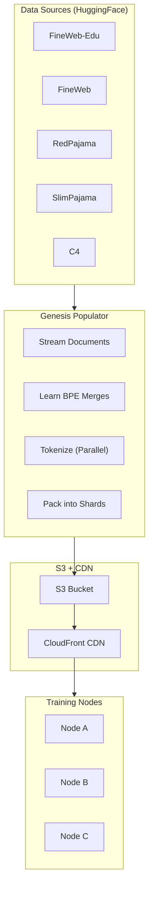
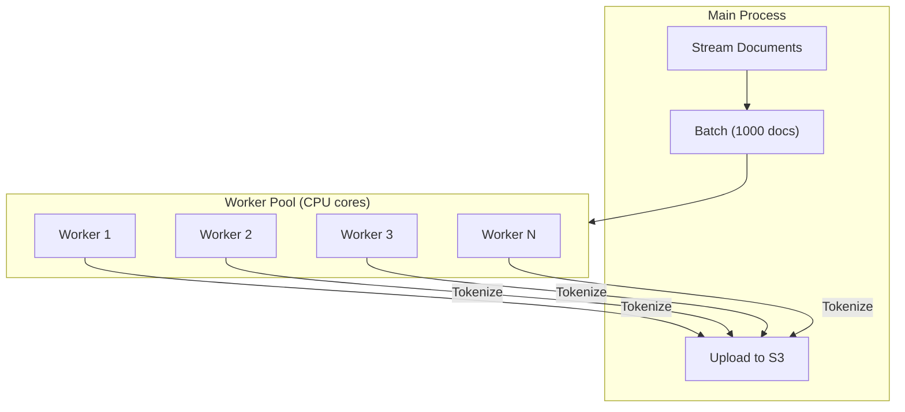
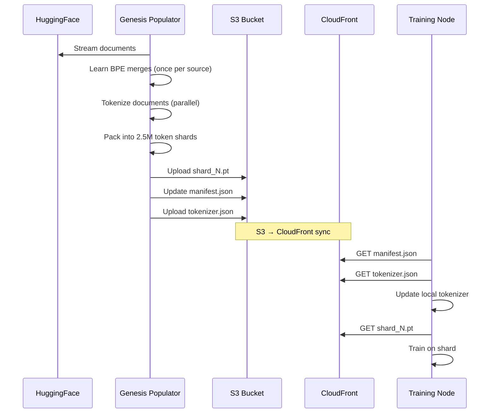

# Genesis Data Pipeline

The Genesis Data Pipeline tokenizes and distributes training data across the NeuroShard network.

## Overview



## Data Sources

Training data comes from verified, high-quality open datasets:

| Source | Description | Target Shards | Priority |
|--------|-------------|---------------|----------|
| fineweb-edu | Educational web content | 500,000 | 1 |
| fineweb | General web content | 50,000 | 2 |
| redpajama | LLaMA reproduction data | 3,000 | 3 |
| slimpajama | Cleaned CommonCrawl | 2,000 | 4 |
| c4 | Colossal Clean Crawled Corpus | 1,000 | 5 |

### Source Configuration

```json
{
  "sources": [
    {
      "name": "fineweb-edu",
      "hf_path": "HuggingFaceFW/fineweb-edu",
      "hf_name": "sample-10BT",
      "text_field": "text",
      "target_shards": 500000,
      "priority": 1,
      "enabled": true
    }
  ]
}
```

## Sharding

### Shard Format

Each shard is a PyTorch tensor containing pre-tokenized data:

```python
# Shard structure
shard = torch.tensor([
    token_1, token_2, ..., token_2500000
], dtype=torch.int64)

# Saved as .pt file
torch.save(shard, f"shard_{shard_id}.pt")
```

| Property | Value |
|----------|-------|
| Tokens per shard | 2,500,000 |
| File size | ~20 MB |
| Format | PyTorch tensor (.pt) |
| Dtype | int64 |

### Why Pre-Tokenized?

1. **Efficiency**: Training nodes don't re-tokenize
2. **Consistency**: All nodes use identical tokens
3. **Speed**: Direct tensor loading (no text processing)
4. **Bandwidth**: 20MB tensor vs ~15MB text + CPU tokenization

## BPE Learning

Before tokenizing, the Genesis Populator learns BPE merges from a sample:

```python
def _learn_tokenizer_merges(self):
    """Learn BPE vocabulary from data sample."""
    
    # Sample 10,000 documents
    sample_texts = []
    for doc in self.dataset.take(10000):
        sample_texts.append(doc[self.text_field])
    
    # Learn merges (creates 31,734 merge rules)
    self.tokenizer.learn_merges(
        sample_texts,
        num_merges=31734  # 32000 - 266 base tokens
    )
    
    # Save learned tokenizer
    self.tokenizer.save("learned_tokenizer.json")
    
    # Upload to S3 for distribution
    self._upload_tokenizer_to_s3()
```

### Vocabulary Growth by Source

Each data source contributes merges proportionally:

```
Total merges: 31,734
├── fineweb-edu:  ~2,500 (current)
├── fineweb:      ~26,000 (pending)
├── redpajama:    ~1,500 (pending)
├── slimpajama:   ~900 (pending)
└── c4:           ~500 (pending)
```

## Parallel Processing

The Genesis Populator uses multiprocessing for high throughput:



### Worker Configuration

```python
# Each worker loads the learned BPE tokenizer
def _init_worker_tokenizer():
    global _worker_tokenizer
    _worker_tokenizer = NeuroTokenizer.load("learned_tokenizer.json")

# Parallel tokenization
with Pool(processes=num_cpus, initializer=_init_worker_tokenizer) as pool:
    tokens = pool.map(_tokenize_document, documents)
```

## S3 Storage

All data is stored in a single S3 bucket:

```
s3://neuroshard-training-data/
├── manifest.json           # Index of all shards
├── tokenizer.json          # Current BPE vocabulary
├── checkpoints.json        # Processing state (for resume)
├── shard_0.pt             # Shard 0 (2.5M tokens)
├── shard_1.pt             # Shard 1
├── shard_2.pt             # Shard 2
└── ...
```

### Manifest Format

```json
{
  "total_shards": 128,
  "total_tokens": 320000000,
  "total_size_bytes": 2560000000,
  "tokenizer_version": "bpe_v1",
  "sources": {
    "fineweb-edu": {
      "shards": 128,
      "tokens": 320000000,
      "documents_processed": 85000,
      "last_shard_id": 127
    }
  },
  "created_at": "2025-12-09T20:00:00Z",
  "updated_at": "2025-12-09T20:52:00Z"
}
```

### Checkpoint Format (Resume Support)

```json
{
  "fineweb-edu": {
    "documents_processed": 85000,
    "last_shard_id": 127,
    "leftover_tokens": [1234, 5678, ...],
    "timestamp": "2025-12-09T20:52:00Z"
  }
}
```

## CDN Distribution

CloudFront CDN provides global, low-latency access:

```
https://dwquwt9gkkeil.cloudfront.net/
├── manifest.json     (cached, auto-invalidated on update)
├── tokenizer.json    (cached, auto-invalidated on update)
└── shard_*.pt        (cached until overwritten)
```

### Benefits

| Feature | Benefit |
|---------|---------|
| Edge caching | <50ms latency globally |
| DDoS protection | AWS Shield integration |
| Cost | S3 egress → CloudFront (cheaper) |
| Scalability | Handles thousands of nodes |

## Training Node Integration

Training nodes download data through the CDN:

```python
class GenesisDataLoader:
    GENESIS_CDN_URL = "https://dwquwt9gkkeil.cloudfront.net"
    
    def __init__(self, node_id: str):
        self.manifest = self._fetch_manifest()
        self._load_learned_tokenizer()
    
    def _fetch_manifest(self):
        """Get current shard index."""
        resp = requests.get(f"{self.GENESIS_CDN_URL}/manifest.json")
        return resp.json()
    
    def _load_learned_tokenizer(self):
        """Update tokenizer with latest BPE merges."""
        resp = requests.get(f"{self.GENESIS_CDN_URL}/tokenizer.json")
        remote_tok = resp.json()
        
        if remote_tok["next_merge_id"] > self.tokenizer.next_merge_id:
            # Update local tokenizer with new merges
            self.tokenizer.update_from_dict(remote_tok)
    
    def download_shard(self, shard_id: int) -> torch.Tensor:
        """Download pre-tokenized shard."""
        url = f"{self.GENESIS_CDN_URL}/shard_{shard_id}.pt"
        resp = requests.get(url)
        
        # Save to local cache
        cache_path = f"~/.neuroshard/data_cache/shard_{shard_id}.pt"
        with open(cache_path, 'wb') as f:
            f.write(resp.content)
        
        return torch.load(cache_path, weights_only=True)
```

### Shard Selection

Nodes select shards based on their ID for reproducibility:

```python
def get_assigned_shards(node_id: str, num_shards: int) -> List[int]:
    """Deterministic shard assignment."""
    # Hash node ID for even distribution
    node_hash = int(hashlib.sha256(node_id.encode()).hexdigest(), 16)
    
    # Primary shard
    primary = node_hash % num_shards
    
    # Additional shards (round-robin from primary)
    return [(primary + i) % num_shards for i in range(10)]
```

### Adaptive Shard Rotation

Shards rotate automatically in two scenarios:

1. **Data Exhaustion**: When all tokens in a shard have been used
2. **Loss Plateau**: When the model stops learning from current data

```python
def _should_rotate_early(self) -> bool:
    """Detect loss plateau for early shard rotation."""
    # Need enough loss history
    if len(self._loss_history) < 20:
        return False
    
    # Check if loss has plateaued at LOW value
    recent_losses = self._loss_history[-20:]
    avg_loss = sum(recent_losses) / len(recent_losses)
    variance = sum((l - avg_loss) ** 2 for l in recent_losses) / len(recent_losses)
    
    # Plateau: low variance + low absolute loss
    if variance < 0.02 and avg_loss < 0.05:
        return True  # Rotate to fresh data
    
    return False
```

**Why this matters:**
- Without plateau detection, a node might train on 5-6 shards until loss is 0.01
- The model memorizes those shards instead of generalizing
- With plateau detection, the model sees all 500+ assigned shards
- Result: Better generalization, less overfitting

| Scenario | Shards Seen | Coverage |
|----------|-------------|----------|
| Without plateau detection | ~5-6 | 1% |
| With plateau detection | All 500 | 100% |

## Data Flow Summary



## Current Status

| Metric | Value |
|--------|-------|
| Active sources | Multiple (see `genesis_ctl.sh status`) |
| Total shards | **Growing** (check manifest for latest) |
| Total tokens | **Growing** |
| Tokenizer vocab | **Dynamic** (`current_vocab_size` in tokenizer.json) |
| Max vocab | 10M (effectively unlimited) |
| Target shards | 600,000+ |

::: tip Live Status
Check current progress with:
```bash
./scripts/genesis_ctl.sh status
# Or query CDN directly:
curl -s https://dwquwt9gkkeil.cloudfront.net/manifest.json | jq
curl -s https://dwquwt9gkkeil.cloudfront.net/tokenizer.json | jq '{vocab_size, next_merge_id: .next_merge_id, sources: .sources_contributed}'
```
:::

## Monitoring

### Genesis Service

```bash
# Check status
./scripts/genesis_ctl.sh status

# View logs
tail -f logs/genesis_fineweb-edu.log

# Check manifest
curl -s https://dwquwt9gkkeil.cloudfront.net/manifest.json | jq
```

### S3 Contents

```bash
# List shards
aws s3 ls s3://neuroshard-training-data/ --recursive | head -20

# Check manifest
aws s3 cp s3://neuroshard-training-data/manifest.json - | jq
```

## Next Steps

- [Tokenization](/architecture/tokenization) — BPE tokenizer details
- [Training Pipeline](/guide/training-pipeline) — How training uses this data
- [DiLoCo Protocol](/architecture/diloco) — Distributed training protocol
