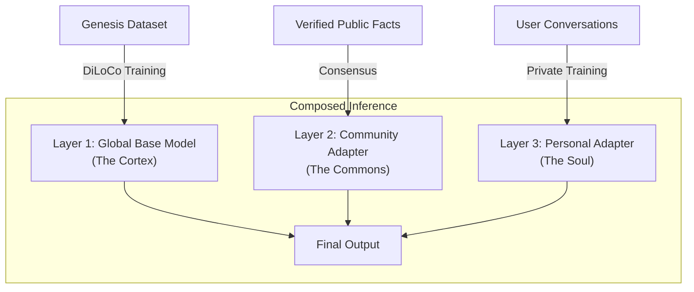

# NeuroMemory Architecture

::: info Status
**Concept Phase**. This document outlines the proposed architecture for long-term memory and state persistence. Implementation is currently in the roadmap phase.
:::

## The Memory Problem

Traditional LLMs suffer from two critical flaws regarding memory:

1.  **Amnesia**: They rely on a "context window" (e.g., 4096 tokens). Once a conversation exceeds this, information is lost forever.
2.  **Privacy Paradox**: If you train a centralized model on user data to give it memory, you leak secrets to every other user. If you don't, the model remains impersonal.

**NeuroShard solves this via a Hybrid Memory Architecture**: dissociating general intelligence (Global) from personal identity (Local).

## The Hybrid Architecture

NeuroMemory uses a **Three-Layer Compositional approach**. Instead of a single monolithic weight matrix, the final model is a composition of three distinct layers at inference time.

### Layer 1: The Cortex (Global Base Model)
*   **Source**: Genesis Dataset (Verified Public Data).
*   **Nature**: Immutable regarding user interactions. Contains logic, reasoning, grammar, and world knowledge.
*   **Training**: Global DiLoCo + PoNW.
*   **Size**: Full Model (e.g., 350M - 120B params).
*   **Privacy**: Public.

### Layer 2: The Commons (Community Knowledge)
*   **Source**: Opt-in user contributions, sanitized and verified.
*   **Nature**: Shared cultural knowledge, news, real-time events.
*   **Training**: Aggregated "Fact Mining".
*   **Size**: Medium Adapter (LoRA).
*   **Privacy**: Public.

### Layer 3: The Soul (Personal Memory)
*   **Source**: Private user conversations and preferences.
*   **Nature**: Secrets, biographical data, style preferences, long-term history.
*   **Training**: Local/Private LoRA updates.
*   **Size**: Small Adapter (e.g., 5-50MB).
*   **Privacy**: **Strictly Private**. Encrypted by user wallet.

---

## Technical Implementation

### 1. Hierarchical Storage

Memory is not just one thing; it is a pipeline from short-term to long-term storage.

| Tier | Technology | Persistence | Capacity | Latency |
|------|------------|-------------|----------|---------|
| **Working Memory** | Context Window | Seconds | ~2048 Tokens | Instant |
| **Episodic Memory** | Vector DB (RAG) | Days/Weeks | Unlimited | Low (Retrieval) |
| **Procedural Memory** | LoRA Weights | Permanent | Fixed Size | Zero (In-weights) |

### 2. The Learning Loop

How does a conversation become a permanent memory?

1.  **Interaction**: User chats with the node.
2.  **Extraction**: A background process analyzes the chat (within the user's private enclave) to extract facts.
    *   *Input*: "I'm allergic to peanuts."
    *   *Extraction*: `Fact(subject="User", relation="allergy", object="peanuts", confidence=0.99)`
3.  **Vector Storage**: The fact is stored in a local Vector DB for immediate RAG retrieval.
4.  **Consolidation (The "Dream" Phase)**:
    *   Periodically (e.g., nightly), the node fine-tunes the **Personal LoRA Adapter** on the accumulated facts in the Vector DB.
    *   This moves memory from "searchable text" to "learned intuition".

### 3. Low-Rank Adaptation (LoRA)

We cannot retrain the multi-gigabyte base model for every user. Instead, we use LoRA:

$$
W_{final} = W_{base} + \Delta W_{community} + \Delta W_{personal}
$$

*   **Efficiency**: A LoRA adapter for a 7B model can be as small as 10MB.
*   **Portability**: Users can carry their "Soul" (adapter) on a USB drive or store it encrypted on IPFS.
*   **Security**: The base model weights $W_{base}$ are never touched by private data.

---

## Privacy & Ownership Model

### The "Sovereign Mind" Principle
In NeuroShard, **you own your AI's memory**.

1.  **Encryption**: Personal adapters are encrypted with the user's wallet private key.
2.  **Portability**: If you switch nodes, you simply authorize the new node to load your encrypted adapter.
3.  **The "Right to Forget"**:
    *   *Delete Fact*: Remove specific entry from Vector DB.
    *   *Wipe Memory*: Delete the LoRA adapter. The AI instantly "forgets" you, reverting to the base model.

### Threat Model Mitigation

| Threat | Mitigation |
|--------|------------|
| **Model Poisoning** | Malicious data only affects the user's *own* Personal Adapter. The Base Model is immune. |
| **Data Leakage** | Personal Adapters are never merged into the Global Base Model. |
| **Node Compromise** | Adapters are encrypted at rest. In-memory context is flushed after inference. |

---

## Economic Model

Memory requires storage and compute.

1.  **Storage Fees**: Users pay a small amount of NEURO to nodes for hosting their Encrypted Personal Adapters and Vector indices.
2.  **Contribution Rewards**: Users can choose to "publish" non-sensitive facts to the **Community Layer** (e.g., "The cafe on Main St is closed today").
    *   If verified by consensus, the user earns NEURO.
    *   This incentivizes the creation of a real-time, shared world model.

---

## Implementation Roadmap

### Phase 1: Session Memory (Short-Term)
*   [ ] Implement local Vector Store (e.g., Chroma/FAISS).
*   [ ] Enable RAG (Retrieval Augmented Generation) for chat history.
*   [ ] Allow multi-turn conversations via API.

### Phase 2: Personal Adapters (Long-Term)
*   [ ] Implement LoRA loading/unloading mechanism in inference engine.
*   [ ] Create "Fact Extraction" background worker.
*   [ ] Build encrypted storage format for adapters.

### Phase 3: Community Consensus
*   [ ] Protocol for submitting facts to the Community Layer.
*   [ ] Verification mechanism for public facts.
