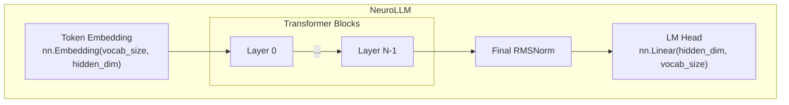
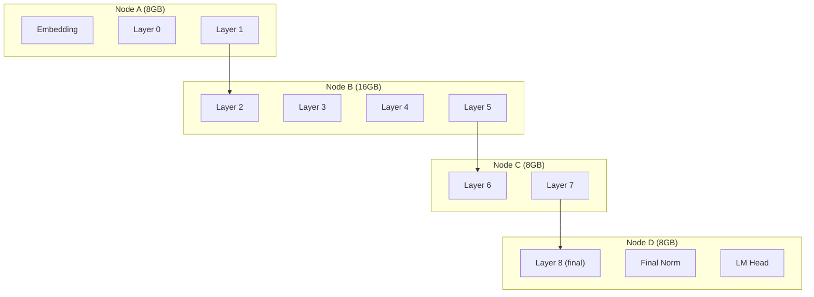

# NeuroLLM Model Architecture

NeuroLLM is a custom transformer architecture designed for distributed training and inference across heterogeneous hardware.

::: tip Mathematical Details
For complete mathematical derivations of RMSNorm, RoPE, GQA, SwiGLU, and attention mechanisms, see [Mathematical Foundations](/architecture/mathematical-foundations).
:::

## Core Design



Each transformer block contains:
- **RMSNorm** (pre-norm)
- **GQA Attention** + RoPE + FlashAttention
- **RMSNorm** (pre-norm)
- **SwiGLU FFN** (up_proj, gate, down)

## Architecture Specification

```python
@dataclass
class ModelArchitecture:
    num_layers: int = 16        # Depth (grows with network)
    hidden_dim: int = 1024      # Width (grows with network)
    num_heads: int = 8          # Attention heads
    num_kv_heads: int = 2       # GQA key-value heads
    ffn_dim: int = 4096         # FFN intermediate (4x hidden)
    vocab_size: int = dynamic   # Grows without limit!
    max_seq_len: int = 2048     # Context length
    dropout: float = 0.0        # No dropout for inference
    rope_base: float = 10000.0  # RoPE theta
```

::: tip Ever-Growing Model
NeuroShard is designed to grow **without limits**:
- **Vocabulary**: Expands as tokenizer learns from millions of users
- **Layers**: Increase as more nodes join the network
- **Width**: Scales with total network memory

The embedding layer automatically expands in 32K chunks when the tokenizer vocabulary exceeds current capacity. See [Tokenization (BPE)](/architecture/tokenization) for details.
:::

## Key Innovations

### 1. RMSNorm (Pre-Normalization)

Uses Root Mean Square Layer Normalization instead of LayerNorm.

#### Mathematical Formula

$$
\text{RMSNorm}(x) = \frac{x}{\text{RMS}(x)} \cdot \gamma
$$

Where:
$$
\text{RMS}(x) = \sqrt{\frac{1}{d}\sum_{i=1}^{d} x_i^2 + \epsilon}
$$

**Comparison with LayerNorm:**

| | LayerNorm | RMSNorm |
|-|-----------|---------|
| Formula | $\frac{x - \mu}{\sigma} \cdot \gamma + \beta$ | $\frac{x}{\text{RMS}(x)} \cdot \gamma$ |
| Parameters | $\gamma, \beta$ | $\gamma$ only |
| Operations | Mean, variance | RMS only |

```python
class RMSNorm(nn.Module):
    def __init__(self, dim: int, eps: float = 1e-6):
        super().__init__()
        self.weight = nn.Parameter(torch.ones(dim))
        self.eps = eps

    def forward(self, x: torch.Tensor) -> torch.Tensor:
        # RMS = sqrt(mean(x^2))
        rms = torch.sqrt(torch.mean(x ** 2, dim=-1, keepdim=True) + self.eps)
        return x / rms * self.weight
```

**Benefits**:
- ~10% faster than LayerNorm (no mean subtraction)
- More stable gradients for deep networks
- Used in LLaMA, Gemma, etc.

### 2. Rotary Position Embeddings (RoPE)

Position information encoded via rotation in complex space.

#### Mathematical Formula

For position $m$ and dimension pair $(i, i+1)$:

$$
\text{RoPE}(x, m)_{2i:2i+2} = \begin{pmatrix} \cos(m\theta_i) & -\sin(m\theta_i) \\ \sin(m\theta_i) & \cos(m\theta_i) \end{pmatrix} \begin{pmatrix} x_{2i} \\ x_{2i+1} \end{pmatrix}
$$

**Frequency schedule:**
$$
\theta_i = 10000^{-2i/d}
$$

**Key property** (relative position awareness):
$$
\langle \text{RoPE}(q, m), \text{RoPE}(k, n) \rangle = f(q, k, m-n)
$$

The attention score depends only on **relative position** $(m - n)$!

**Complex number formulation** (equivalent, more elegant):
$$
\text{RoPE}(x, m) = x \odot e^{im\theta}
$$

```python
def apply_rope(x: torch.Tensor, freqs: torch.Tensor) -> torch.Tensor:
    """Apply rotary position embeddings to x."""
    # x: (batch, heads, seq_len, head_dim)
    # freqs: (seq_len, head_dim // 2)
    
    x_complex = torch.view_as_complex(x.reshape(*x.shape[:-1], -1, 2))
    freqs_complex = torch.polar(torch.ones_like(freqs), freqs)
    x_rotated = x_complex * freqs_complex
    return torch.view_as_real(x_rotated).flatten(-2)
```

**Properties**:
- Relative position awareness
- Extrapolates to longer sequences than training
- No learnable parameters
- Decays naturally with distance (via high-frequency components)

**Precomputation**:

```python
def precompute_rope_freqs(dim: int, max_seq: int, theta: float = 10000.0):
    freqs = 1.0 / (theta ** (torch.arange(0, dim, 2).float() / dim))
    positions = torch.arange(max_seq)
    angles = torch.outer(positions, freqs)
    return angles
```

### 3. Grouped Query Attention (GQA)

Reduces KV cache memory by sharing key-value heads across query heads.

#### Mathematical Formula

**Projections:**
$$
Q = xW_Q \in \mathbb{R}^{B \times L \times H \times d_h}, \quad K = xW_K \in \mathbb{R}^{B \times L \times G \times d_h}, \quad V = xW_V \in \mathbb{R}^{B \times L \times G \times d_h}
$$

Where $H$ = query heads, $G$ = KV heads, $G < H$.

**Head expansion:**
$$
K' = \text{repeat}(K, H/G), \quad V' = \text{repeat}(V, H/G)
$$

**Scaled dot-product attention:**
$$
\text{Attention}(Q, K', V') = \text{softmax}\left(\frac{QK'^T}{\sqrt{d_h}}\right) V'
$$

**Why scale by $\sqrt{d_h}$?** If $q, k$ have unit variance:
$$
\text{Var}(q \cdot k) = d_h \implies \text{Var}\left(\frac{q \cdot k}{\sqrt{d_h}}\right) = 1
$$

This prevents softmax saturation (extreme probabilities → vanishing gradients).

```
Standard MHA:  Q[8 heads] x K[8 heads] x V[8 heads]
GQA (4:1):     Q[8 heads] x K[2 heads] x V[2 heads]
```

```python
class GroupedQueryAttention(nn.Module):
    def __init__(self, config):
        self.num_heads = config.num_heads        # 8 query heads
        self.num_kv_heads = config.num_kv_heads  # 2 kv heads
        self.head_dim = config.hidden_dim // config.num_heads
        
        self.q_proj = nn.Linear(config.hidden_dim, config.num_heads * self.head_dim)
        self.k_proj = nn.Linear(config.hidden_dim, config.num_kv_heads * self.head_dim)
        self.v_proj = nn.Linear(config.hidden_dim, config.num_kv_heads * self.head_dim)
        self.o_proj = nn.Linear(config.num_heads * self.head_dim, config.hidden_dim)

    def forward(self, x, freqs, mask=None):
        B, L, _ = x.shape
        
        q = self.q_proj(x).view(B, L, self.num_heads, self.head_dim)
        k = self.k_proj(x).view(B, L, self.num_kv_heads, self.head_dim)
        v = self.v_proj(x).view(B, L, self.num_kv_heads, self.head_dim)
        
        # Apply RoPE
        q = apply_rope(q, freqs)
        k = apply_rope(k, freqs)
        
        # Expand KV heads to match query heads
        k = k.repeat_interleave(self.num_heads // self.num_kv_heads, dim=2)
        v = v.repeat_interleave(self.num_heads // self.num_kv_heads, dim=2)
        
        # Attention
        attn = F.scaled_dot_product_attention(q, k, v, attn_mask=mask)
        return self.o_proj(attn.reshape(B, L, -1))
```

**Memory savings**: KV cache reduced by factor $H/G$ (e.g., 4× for $H=8, G=2$)

### 4. SwiGLU Activation

Gated Linear Unit with SiLU (Swish) activation.

#### Mathematical Formula

$$
\text{SwiGLU}(x) = \text{SiLU}(xW_{\text{gate}}) \odot (xW_{\text{up}})
$$

Where **SiLU** (Swish) is:
$$
\text{SiLU}(x) = x \cdot \sigma(x) = \frac{x}{1 + e^{-x}}
$$

**Full FFN block:**
$$
\text{FFN}(x) = \left(\text{SiLU}(xW_{\text{gate}}) \odot (xW_{\text{up}})\right) W_{\text{down}}
$$

**Activation comparison:**

| Activation | Formula | Gradient |
|------------|---------|----------|
| ReLU | $\max(0, x)$ | Discontinuous at 0 |
| GELU | $x \cdot \Phi(x)$ | Smooth |
| SiLU/Swish | $x \cdot \sigma(x)$ | $\sigma(x)(1 + x(1-\sigma(x)))$ |

**Why gating helps:**
- Allows selective information flow
- Smoother gradients than ReLU
- Empirically better for LLMs

```python
class SwiGLU(nn.Module):
    def __init__(self, hidden_dim: int, ffn_dim: int):
        super().__init__()
        self.gate_proj = nn.Linear(hidden_dim, ffn_dim, bias=False)
        self.up_proj = nn.Linear(hidden_dim, ffn_dim, bias=False)
        self.down_proj = nn.Linear(ffn_dim, hidden_dim, bias=False)

    def forward(self, x: torch.Tensor) -> torch.Tensor:
        gate = F.silu(self.gate_proj(x))  # Swish gating
        up = self.up_proj(x)              # Linear projection
        return self.down_proj(gate * up)  # Gated output
```

**Benefits**:
- Better than ReLU/GELU for LLMs
- Smooth gradients everywhere
- Used in LLaMA, PaLM, Gemma, etc.

## Transformer Block

Complete block combining all components:

```python
class TransformerBlock(nn.Module):
    def __init__(self, config):
        super().__init__()
        self.attention = GroupedQueryAttention(config)
        self.feed_forward = SwiGLU(config.hidden_dim, config.ffn_dim)
        self.attention_norm = RMSNorm(config.hidden_dim)
        self.ffn_norm = RMSNorm(config.hidden_dim)

    def forward(self, x, freqs, mask=None):
        # Pre-norm attention with residual
        h = x + self.attention(self.attention_norm(x), freqs, mask)
        # Pre-norm FFN with residual
        out = h + self.feed_forward(self.ffn_norm(h))
        return out
```

## Architecture Scaling

Model dimensions scale based on network capacity:

| Network Memory | Hidden Dim | Layers | FFN Dim | Heads | Parameters |
|----------------|------------|--------|---------|-------|------------|
| 40 GB | 1024 | 16 | 4096 | 8 | ~350M |
| 200 GB | 2048 | 24 | 8192 | 16 | ~3.5B |
| 800 GB | 3072 | 32 | 12288 | 24 | ~9.2B |
| 4 TB | 5120 | 48 | 20480 | 40 | ~45B |
| 8 TB | 7168 | 64 | 28672 | 56 | ~123B |

**Scaling formula**:

```python
def calculate_optimal_architecture(total_memory_gb: float) -> ModelArchitecture:
    # Width grows as sqrt of memory
    hidden = int(256 * math.sqrt(total_memory_gb / 10))
    hidden = ((hidden + 63) // 64) * 64  # Align to 64
    
    # Depth grows logarithmically
    layers = min(64, max(8, int(8 * math.log2(total_memory_gb / 10 + 1))))
    
    # Heads scale with width
    heads = max(4, hidden // 128)
    
    return ModelArchitecture(
        num_layers=layers,
        hidden_dim=hidden,
        num_heads=heads,
        num_kv_heads=max(1, heads // 4),
        ffn_dim=hidden * 4
    )
```

## Sharding Strategy

Layers are distributed across nodes:



**Assignment algorithm**:

```python
def calculate_layer_assignment(
    node_capacities: Dict[str, float],
    architecture: ModelArchitecture
) -> Dict[str, List[int]]:
    """Assign layers to nodes proportionally to their memory."""
    total_memory = sum(node_capacities.values())
    memory_per_layer = estimate_memory_per_layer(architecture)
    
    assignments = {}
    layer_idx = 0
    
    # Sort nodes for deterministic assignment
    for node_id, memory in sorted(node_capacities.items()):
        num_layers = int(memory / memory_per_layer)
        assignments[node_id] = list(range(layer_idx, layer_idx + num_layers))
        layer_idx += num_layers
    
    return assignments
```

## Forward Pass

Distributed forward with activation streaming:

```python
async def distributed_forward(tokens: torch.Tensor) -> torch.Tensor:
    # Step 1: Embedding (Driver)
    x = embedding(tokens)
    
    # Step 2: Stream through layers
    for layer_idx in range(num_layers):
        peer = router.get_peer_for_layer(layer_idx)
        x = await peer.forward_layer(layer_idx, x)
    
    # Step 3: Final projection (Validator)
    x = final_norm(x)
    logits = lm_head(x)
    
    return logits
```

## Memory Estimation

Per-layer memory calculation:

```python
def estimate_memory_per_layer(arch: ModelArchitecture) -> float:
    """Estimate memory per transformer layer in GB."""
    h = arch.hidden_dim
    f = arch.ffn_dim
    heads = arch.num_heads
    kv_heads = arch.num_kv_heads
    head_dim = h // heads
    
    # Attention parameters
    attn_params = (
        h * heads * head_dim +    # Q
        h * kv_heads * head_dim + # K
        h * kv_heads * head_dim + # V
        heads * head_dim * h      # O
    )
    
    # FFN parameters
    ffn_params = (
        h * f +  # gate_proj
        h * f +  # up_proj
        f * h    # down_proj
    )
    
    # Norms
    norm_params = h * 2
    
    total_params = attn_params + ffn_params + norm_params
    
    # 4 bytes per param (float32)
    bytes_per_layer = total_params * 4
    
    # Add 50% overhead for gradients and activations
    return bytes_per_layer * 1.5 / (1024 ** 3)
```

## Inference Optimization

### KV Cache

Stores key-value states for autoregressive generation:

```python
class KVCache:
    def __init__(self, max_batch: int, max_seq: int, num_kv_heads: int, head_dim: int):
        self.k_cache = torch.zeros(max_batch, num_kv_heads, max_seq, head_dim)
        self.v_cache = torch.zeros(max_batch, num_kv_heads, max_seq, head_dim)
        self.seq_len = 0

    def update(self, k: torch.Tensor, v: torch.Tensor) -> Tuple[torch.Tensor, torch.Tensor]:
        seq_len = k.size(2)
        self.k_cache[:, :, self.seq_len:self.seq_len + seq_len] = k
        self.v_cache[:, :, self.seq_len:self.seq_len + seq_len] = v
        self.seq_len += seq_len
        return self.k_cache[:, :, :self.seq_len], self.v_cache[:, :, :self.seq_len]
```

### Flash Attention

Uses PyTorch's `scaled_dot_product_attention` which automatically selects:
- FlashAttention-2 (when available)
- Memory-efficient attention (for longer sequences)
- Standard attention (fallback)

## Next Steps

- [Mathematical Foundations](/architecture/mathematical-foundations) — RMSNorm, RoPE, GQA, SwiGLU derivations
- [Dynamic Scaling](/architecture/dynamic-scaling) — How architecture adapts
- [DiLoCo Protocol](/architecture/diloco) — Distributed training
- [Swarm Aggregation](/architecture/aggregation) — Byzantine tolerance
