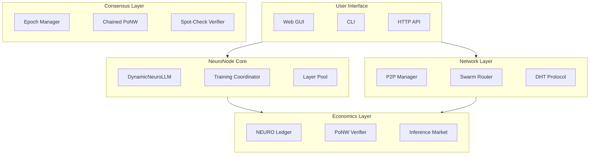

# Architecture Overview

NeuroShard's system architecture consists of three main layers: **Model**, **Network**, and **Economics**.

## High-Level Architecture



## Core Components

### DynamicNeuroLLM

The neural network model, distributed across nodes.

**Key Features**:
- Transformer architecture with RMSNorm, RoPE, GQA, SwiGLU
- **Distributed Mixture of Experts (MoE)** for sparse computation
- Dynamic depth and width based on network capacity
- Sharded across nodes via Layer Pool
- Checkpoint-based persistence

```python
class DynamicNeuroLLM:
    architecture: ModelArchitecture  # Dynamic config
    my_layers: Dict[int, nn.Module]  # Only layers we hold
    my_experts: Dict[int, List[int]] # MoE experts per layer
    embedding: nn.Embedding          # If Driver
    lm_head: nn.Linear              # If Validator
```

### Layer Pool

Manages layer distribution across the network.

**Key Features**:
- DHT-based layer registry
- Automatic layer assignment based on memory
- Redundancy (MIN_REPLICAS = 2 per layer)
- Heartbeat-based liveness detection

```python
class DynamicLayerPool:
    layer_assignments: Dict[int, List[LayerAssignment]]
    current_architecture: ModelArchitecture
    node_capacities: Dict[str, float]
```

### Training Coordinator

Manages distributed training via DiLoCo protocol.

**Key Features**:
- Inner loop: 500 local training steps
- Outer loop: Pseudo-gradient synchronization
- Nesterov momentum optimizer
- Robust gradient aggregation

```python
class DiLoCoTrainer:
    inner_steps: int = 500
    outer_optimizer: OuterOptimizer
    initial_weights: Dict[str, Tensor]
```

### P2P Manager

Handles peer-to-peer communication.

**Key Features**:
- Tracker-based bootstrap
- DHT for peer discovery
- gRPC for direct communication
- NAT traversal

```python
class P2PManager:
    tracker_url: str
    dht: DHTProtocol
    grpc_server: NeuroShardService
```

### Swarm Router

Intelligent routing for fault tolerance.

**Key Features**:
- Multipath routing with failover
- Capacity-weighted peer selection
- Heartbeat-based liveness
- 200ms failover timeout

```python
class SwarmRouter:
    layer_peers: Dict[int, List[PeerInfo]]
    failover_timeout: float = 0.2
```

### NEURO Ledger

Token economics and accounting.

**Key Features**:
- PoNW proof verification
- Reward calculation
- Stake management
- Transaction history
- Fee burn mechanism

```python
class NEUROLedger:
    db_path: str  # SQLite
    crypto: NodeCrypto  # ECDSA
    inference_market: InferenceMarket
```

### Epoch Manager

Blockchain-like epoch chaining for PoNW integrity.

**Key Features**:
- 60-second epochs (Unix minute-based)
- Cryptographic chaining (prev_epoch_hash)
- Model state commitments (hash before/after training)
- Stake-weighted proposer selection
- DHT-based epoch storage

```python
class EpochManager:
    epoch_duration: int = 60  # seconds
    current_epoch_id: int     # int(time.time() / 60)
    pending_proofs: Dict[int, List[PoNWProof]]
    epoch_chain: Dict[int, Epoch]
    
    def accept_proof(self, proof: PoNWProof) -> bool
    def finalize_epoch(self, epoch_id: int) -> Epoch
    def verify_chain_integrity(self, start: int, end: int) -> bool
```

### Chained PoNW

Ensures training work is cryptographically verifiable.

**Key Features**:
- Model hash tracking (start/end)
- Gradient commitments (spot-checkable)
- Epoch-bound proofs (prevents epoch-hopping)
- Slashing for fake training

```python
@dataclass
class PoNWProof:
    # ... existing fields ...
    epoch_id: int              # Which epoch
    model_hash_start: str      # Weights before training
    model_hash_end: str        # Weights after training
    gradient_commitment: str   # Spot-checkable proof
```

## Data Flow

### Inference Flow


### Training Flow


## Technology Stack

| Component | Technology |
|-----------|------------|
| Model | PyTorch |
| API | FastAPI |
| RPC | gRPC + protobuf |
| Database | SQLite |
| Crypto | ECDSA (secp256k1) |
| P2P | Custom DHT |
| UI | Web Dashboard (HTML/JS) |

## Scaling Properties

### Horizontal Scaling

- More nodes → more layers → larger model
- Linear scaling of compute capacity
- Automatic load distribution

### Architecture Scaling

| Nodes | Memory | Architecture | Params |
|-------|--------|-------------|--------|
| 10 | 40GB | 16L × 1024H | 350M |
| 100 | 800GB | 32L × 3072H | 9.2B |
| 1000 | 8TB | 64L × 7168H | 123B |

## Next Steps

- [NeuroLLM Model](/architecture/neurollm) — Model architecture
- [Mixture of Experts](/architecture/mixture-of-experts) — Distributed MoE for sparse computation
- [Genesis Data Pipeline](/architecture/genesis-data) — How training data is prepared and distributed
- [Tokenization (BPE)](/architecture/tokenization) — Byte Pair Encoding tokenizer
- [Dynamic Scaling](/architecture/dynamic-scaling) — How scaling works
- [DiLoCo Protocol](/architecture/diloco) — Training protocol
- [P2P Network](/architecture/p2p-network) — Network layer
- [Mathematical Foundations](/architecture/mathematical-foundations) — Complete mathematical treatment of all algorithms
