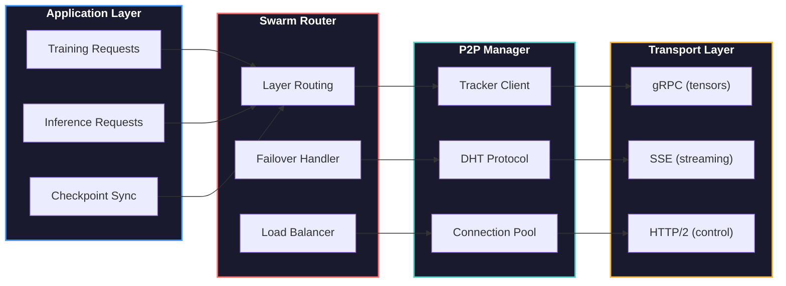

# P2P Network Layer

NeuroShard uses a custom peer-to-peer network layer optimized for distributed machine learning workloads.

## Architecture Overview



## Components

### Tracker Service

Central bootstrap service for peer discovery:

```python
class TrackerServer:
    """
    Lightweight tracking server for node discovery.
    
    Responsibilities:
    - Register new nodes
    - Maintain node list with heartbeats
    - Provide initial peer list for new nodes
    - Track network statistics
    """
    
    def __init__(self, port: int = 8765):
        self.nodes: Dict[str, NodeInfo] = {}
        self.port = port
        self.heartbeat_timeout = 30.0  # seconds

    async def register_node(self, request: RegisterRequest) -> RegisterResponse:
        """Register a new node in the network."""
        node_id = request.node_id
        
        self.nodes[node_id] = NodeInfo(
            node_id=node_id,
            address=request.address,
            port=request.port,
            capacity=request.capacity,
            layers=request.layers,
            last_heartbeat=time.time()
        )
        
        # Return list of peers
        peers = [
            n for n in self.nodes.values()
            if n.node_id != node_id
        ]
        
        return RegisterResponse(
            success=True,
            peers=peers[:50]  # Limit initial peer list
        )

    async def heartbeat(self, request: HeartbeatRequest) -> HeartbeatResponse:
        """Process heartbeat from node."""
        if request.node_id in self.nodes:
            self.nodes[request.node_id].last_heartbeat = time.time()
            self.nodes[request.node_id].layers = request.layers
            return HeartbeatResponse(success=True)
        return HeartbeatResponse(success=False, error="Node not registered")

    async def cleanup_loop(self):
        """Remove stale nodes."""
        while True:
            await asyncio.sleep(10)
            now = time.time()
            stale = [
                node_id for node_id, info in self.nodes.items()
                if now - info.last_heartbeat > self.heartbeat_timeout
            ]
            for node_id in stale:
                del self.nodes[node_id]
                logger.info(f"Removed stale node: {node_id}")
```

### DHT Protocol

Distributed Hash Table for decentralized discovery:

```python
class DHTProtocol:
    """
    Kademlia-style DHT for peer and layer discovery.
    
    Key types:
    - /nodes/{node_id} -> NodeInfo
    - /layers/{layer_idx} -> List[NodeInfo]
    - /checkpoints/{checkpoint_id} -> CheckpointMetadata
    """
    
    def __init__(self, node_id: str, k: int = 20, alpha: int = 3):
        self.node_id = node_id
        self.k = k  # Bucket size
        self.alpha = alpha  # Parallel lookups
        self.routing_table = RoutingTable(node_id, k)
        self.storage: Dict[str, bytes] = {}

    async def put(self, key: str, value: bytes, ttl: int = 3600) -> bool:
        """Store value in DHT."""
        # Find k closest nodes to key
        closest = await self.find_nodes(key)
        
        # Store on all k closest
        success_count = 0
        for node in closest[:self.k]:
            try:
                await node.rpc.store(key, value, ttl)
                success_count += 1
            except Exception:
                pass
        
        return success_count > 0

    async def get(self, key: str) -> Optional[bytes]:
        """Retrieve value from DHT."""
        # Check local storage first
        if key in self.storage:
            return self.storage[key]
        
        # Find nodes and query
        closest = await self.find_nodes(key)
        
        for node in closest:
            try:
                value = await node.rpc.retrieve(key)
                if value:
                    return value
            except Exception:
                pass
        
        return None

    async def find_nodes(self, key: str) -> List[NodeInfo]:
        """Find k closest nodes to a key."""
        key_id = self._hash_key(key)
        
        # Start with nodes from our routing table
        closest = self.routing_table.find_closest(key_id, self.k)
        queried = set()
        
        while True:
            # Query alpha closest unqueried nodes
            to_query = [n for n in closest if n.node_id not in queried][:self.alpha]
            
            if not to_query:
                break
            
            # Parallel queries
            for node in to_query:
                queried.add(node.node_id)
                try:
                    new_nodes = await node.rpc.find_node(key_id)
                    closest.extend(new_nodes)
                except Exception:
                    pass
            
            # Keep k closest
            closest = sorted(
                closest,
                key=lambda n: self._distance(n.node_id, key_id)
            )[:self.k]
        
        return closest
```

### Connection Pool

Manages persistent connections to peers:

```python
class ConnectionPool:
    """
    Pool of persistent connections to peers.
    
    Features:
    - Connection reuse
    - Automatic reconnection
    - Health checking
    - Load balancing
    """
    
    def __init__(
        self,
        max_connections_per_peer: int = 3,
        connection_timeout: float = 5.0,
        idle_timeout: float = 60.0
    ):
        self.max_per_peer = max_connections_per_peer
        self.connection_timeout = connection_timeout
        self.idle_timeout = idle_timeout
        
        self.pools: Dict[str, List[Connection]] = defaultdict(list)
        self.lock = asyncio.Lock()

    async def get_connection(self, peer_id: str, address: str) -> Connection:
        """Get or create connection to peer."""
        async with self.lock:
            # Check for existing idle connection
            pool = self.pools[peer_id]
            for conn in pool:
                if not conn.in_use and conn.is_healthy():
                    conn.in_use = True
                    return conn
            
            # Create new if under limit
            if len(pool) < self.max_per_peer:
                conn = await self._create_connection(peer_id, address)
                pool.append(conn)
                conn.in_use = True
                return conn
            
            # Wait for available connection
            while True:
                for conn in pool:
                    if not conn.in_use and conn.is_healthy():
                        conn.in_use = True
                        return conn
                await asyncio.sleep(0.01)

    async def release_connection(self, peer_id: str, conn: Connection):
        """Release connection back to pool."""
        conn.in_use = False
        conn.last_used = time.time()
```

### Swarm Router

Intelligent routing with failover:

```python
class SwarmRouter:
    """
    Routes requests to appropriate peers based on layer ownership.
    
    Features:
    - Layer-based routing
    - Automatic failover
    - Load balancing
    - Health tracking
    """
    
    def __init__(
        self,
        connection_pool: ConnectionPool,
        failover_timeout: float = 0.2
    ):
        self.pool = connection_pool
        self.failover_timeout = failover_timeout
        
        # Layer -> List of peers that have it
        self.layer_peers: Dict[int, List[PeerInfo]] = defaultdict(list)
        self.peer_health: Dict[str, float] = {}  # peer_id -> success rate

    async def route_to_layer(
        self,
        layer_idx: int,
        request: ForwardRequest
    ) -> ForwardResponse:
        """
        Route forward request to a peer with the layer.
        
        Implements failover with timeout.
        """
        peers = self.layer_peers.get(layer_idx, [])
        
        if not peers:
            raise ValueError(f"No peers for layer {layer_idx}")
        
        # Sort by health score
        sorted_peers = sorted(
            peers,
            key=lambda p: self.peer_health.get(p.peer_id, 0.5),
            reverse=True
        )
        
        last_error = None
        
        for peer in sorted_peers:
            try:
                conn = await self.pool.get_connection(peer.peer_id, peer.address)
                
                response = await asyncio.wait_for(
                    conn.stub.Forward(request),
                    timeout=self.failover_timeout
                )
                
                # Update health on success
                self._update_health(peer.peer_id, success=True)
                await self.pool.release_connection(peer.peer_id, conn)
                
                return response
                
            except asyncio.TimeoutError:
                self._update_health(peer.peer_id, success=False)
                last_error = f"Timeout from {peer.peer_id}"
                logger.warning(f"Failover: {last_error}")
                
            except Exception as e:
                self._update_health(peer.peer_id, success=False)
                last_error = str(e)
                logger.warning(f"Error from {peer.peer_id}: {e}")
        
        raise RuntimeError(f"All peers failed for layer {layer_idx}: {last_error}")
```

## gRPC Service

Protocol buffer definitions:

```protobuf
syntax = "proto3";

package neuroshard;

service NeuroShard {
  // Layer forward pass
  rpc Forward(ForwardRequest) returns (ForwardResponse);
  
  // Layer backward pass
  rpc Backward(BackwardRequest) returns (BackwardResponse);
  
  // Gradient exchange for DiLoCo
  rpc ExchangeGradient(GradientRequest) returns (GradientResponse);
  
  // Checkpoint operations
  rpc GetCheckpoint(CheckpointRequest) returns (stream CheckpointChunk);
  rpc PutCheckpoint(stream CheckpointChunk) returns (CheckpointResponse);
  
  // Health and discovery
  rpc Ping(PingRequest) returns (PingResponse);
  rpc GetPeers(GetPeersRequest) returns (GetPeersResponse);
}

message ForwardRequest {
  int32 layer_idx = 1;
  bytes activations = 2;  // Serialized tensor
  int32 batch_size = 3;
  int32 seq_len = 4;
}

message ForwardResponse {
  bytes activations = 1;
  bytes proof = 2;  // PoNW proof
}

message GradientRequest {
  string round_id = 1;
  string node_id = 2;
  map<string, bytes> gradients = 3;  // Compressed gradients
}

message GradientResponse {
  map<string, bytes> gradients = 1;
}
```

### gRPC Server

```python
class NeuroShardService(neuroshard_pb2_grpc.NeuroShardServicer):
    """gRPC service implementation."""
    
    def __init__(self, node: "NeuroNode"):
        self.node = node

    async def Forward(
        self,
        request: ForwardRequest,
        context: grpc.aio.ServicerContext
    ) -> ForwardResponse:
        """Handle forward pass request."""
        layer_idx = request.layer_idx
        
        # Deserialize activations
        activations = self._deserialize_tensor(request.activations)
        
        # Get layer and compute forward
        layer = self.node.layers.get(layer_idx)
        if layer is None:
            context.set_code(grpc.StatusCode.NOT_FOUND)
            context.set_details(f"Layer {layer_idx} not found")
            return ForwardResponse()
        
        with torch.no_grad():
            output = layer(activations)
        
        # Generate PoNW proof
        proof = self.node.generate_proof(layer_idx, activations, output)
        
        return ForwardResponse(
            activations=self._serialize_tensor(output),
            proof=proof.serialize()
        )

    async def ExchangeGradient(
        self,
        request: GradientRequest,
        context: grpc.aio.ServicerContext
    ) -> GradientResponse:
        """Exchange gradients with peer."""
        # Decompress received gradients
        peer_grads = {
            name: self._decompress(data)
            for name, data in request.gradients.items()
        }
        
        # Store for aggregation
        self.node.gradient_buffer.add(request.node_id, peer_grads)
        
        # Return our gradients
        local_grads = self.node.get_local_gradients()
        
        return GradientResponse(
            gradients={
                name: self._compress(tensor)
                for name, tensor in local_grads.items()
            }
        )
```

## NAT Traversal

Handling nodes behind NATs:

```python
class NATTraversal:
    """
    NAT traversal for nodes behind firewalls.
    
    Strategies:
    1. UPnP port mapping
    2. STUN for public IP discovery
    3. TURN relay as fallback
    """
    
    async def setup(self, local_port: int) -> Tuple[str, int]:
        """
        Attempt to establish public endpoint.
        
        Returns:
            (public_ip, public_port)
        """
        # Try UPnP first
        try:
            public = await self._try_upnp(local_port)
            if public:
                return public
        except Exception as e:
            logger.debug(f"UPnP failed: {e}")
        
        # Try STUN
        try:
            public = await self._try_stun()
            if public:
                return public
        except Exception as e:
            logger.debug(f"STUN failed: {e}")
        
        # Fall back to relay
        return await self._setup_relay(local_port)
```

## Bandwidth Optimization

### Tensor Compression

```python
class TensorCompressor:
    """Compress tensors for transmission."""
    
    def __init__(
        self,
        method: str = "lz4",
        sparsify_threshold: float = 0.01
    ):
        self.method = method
        self.sparsify_threshold = sparsify_threshold

    def compress(self, tensor: torch.Tensor) -> bytes:
        """Compress tensor."""
        # Sparsify small values
        if self.sparsify_threshold > 0:
            mask = tensor.abs() > self.sparsify_threshold
            tensor = tensor * mask
        
        # Convert to bytes
        buffer = io.BytesIO()
        torch.save(tensor.cpu().half(), buffer)  # Use fp16
        data = buffer.getvalue()
        
        # Compress
        if self.method == "lz4":
            return lz4.frame.compress(data)
        elif self.method == "zstd":
            import zstd
            return zstd.compress(data)
        else:
            return data
```

### Gradient Compression

```python
class GradientCompressor:
    """
    Compress gradients for DiLoCo synchronization.
    
    Uses Top-K sparsification + quantization.
    """
    
    def __init__(self, top_k_fraction: float = 0.1):
        self.top_k_fraction = top_k_fraction

    def compress(self, gradient: Dict[str, torch.Tensor]) -> bytes:
        """Compress gradient dict."""
        compressed = {}
        
        for name, tensor in gradient.items():
            flat = tensor.flatten()
            k = max(1, int(flat.numel() * self.top_k_fraction))
            
            # Get top-k values and indices
            values, indices = torch.topk(flat.abs(), k)
            signs = torch.sign(flat[indices])
            
            compressed[name] = {
                'shape': tensor.shape,
                'indices': indices.cpu().numpy().astype(np.uint32),
                'values': (values * signs).cpu().half().numpy(),
            }
        
        return pickle.dumps(compressed)
```

## Configuration

```python
# Network parameters
# Note: gRPC port = HTTP port + 1000 (e.g., 8000 HTTP -> 9000 gRPC)
TRACKER_URL = "https://neuroshard.com/api/tracker"
DHT_BOOTSTRAP_NODES = [
    "bootstrap1.neuroshard.com:9000",
    "bootstrap2.neuroshard.com:9000",
]
GRPC_PORT_OFFSET = 1000            # gRPC port = HTTP port + 1000
HEARTBEAT_INTERVAL = 10.0          # seconds
HEARTBEAT_TIMEOUT = 30.0           # seconds
CONNECTION_TIMEOUT = 5.0           # seconds
FAILOVER_TIMEOUT = 0.2             # seconds
MAX_MESSAGE_SIZE = 100 * 1024 * 1024  # 100 MB
COMPRESSION_METHOD = "lz4"
GRADIENT_TOP_K = 0.1               # Keep top 10% of gradients
```

## Monitoring

```python
# Network metrics
active_connections: int           # Current open connections
connection_pool_size: int         # Total pooled connections
bytes_sent: int                   # Total bytes transmitted
bytes_received: int               # Total bytes received
rpc_latency_ms: float            # Average RPC latency
rpc_success_rate: float          # RPC success rate
peer_count: int                  # Known peers
healthy_peer_count: int          # Healthy peers
```

## Next Steps

- [Mathematical Foundations](/architecture/mathematical-foundations) — Gradient compression math
- [Token Economics](/economics/overview) — Incentive system
- [Proof of Neural Work](/guide/proof-of-neural-work) — PoNW verification
- [Running a Node](/guide/running-a-node) — Node setup
