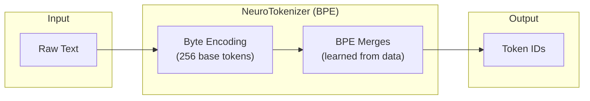
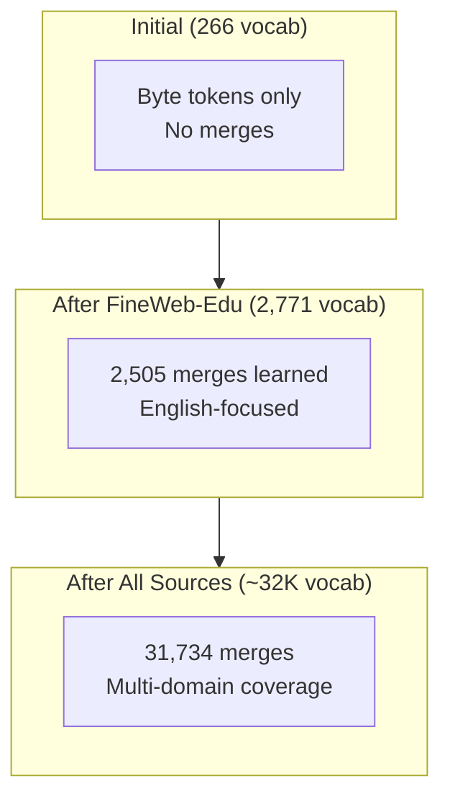

# Tokenization

NeuroShard uses a custom **BPE (Byte Pair Encoding)** tokenizer designed for decentralized training with dynamic vocabulary growth.

## Overview



## Token Structure

The vocabulary is organized in layers and **grows dynamically** as the network expands:

| Token Range | Type | Description |
|-------------|------|-------------|
| 0 | PAD | Padding token |
| 1 | BOS | Beginning of sequence |
| 2 | EOS | End of sequence |
| 3 | UNK | Unknown token |
| 4-9 | Reserved | Future special tokens |
| 10-265 | Byte tokens | Raw bytes (0x00-0xFF) |
| 266+ | BPE merges | Learned subword units (unlimited) |

::: tip Ever-Growing Vocabulary
Unlike traditional LLMs with fixed vocabularies, NeuroShard's vocabulary **grows without limit** as more users join and contribute diverse training data. The model's embedding layer automatically expands to accommodate new tokens.
:::

### Why Byte-Level?

Starting with byte-level tokens ensures:

1. **Universal Coverage**: Any text can be encoded (no unknown characters)
2. **Language Agnostic**: Works with any language or script
3. **Graceful Degradation**: Unknown words fall back to bytes
4. **No Pre-tokenization**: No word boundaries needed

## BPE Learning

The tokenizer learns common byte pairs from training data:

```python
# Example: Learning the merge "th" → 266
# Input bytes: [116, 104] (t=116, h=104)
# After merge: [266]

# Most common English merges learned:
"th" → 266    # "the", "that", "this"
"in" → 267    # "in", "ing", "into"
"er" → 268    # "er", "every", "there"
"an" → 269    # "an", "and", "can"
...
```

### Learning Algorithm

```python
def learn_merges(texts: List[str], num_merges: int = 31734):
    """Learn BPE merges from training data."""
    
    # Count all byte pairs in corpus
    pair_counts = Counter()
    for text in texts:
        bytes_seq = text.encode('utf-8')
        for i in range(len(bytes_seq) - 1):
            pair = (bytes_seq[i] + 10, bytes_seq[i+1] + 10)
            pair_counts[pair] += 1
    
    merges = {}
    next_id = 266  # First merge ID
    
    for _ in range(num_merges):
        # Find most frequent pair
        best_pair = max(pair_counts, key=pair_counts.get)
        
        # Create merge rule
        merges[best_pair] = next_id
        next_id += 1
        
        # Update corpus (merge the pair everywhere)
        update_pair_counts(pair_counts, best_pair, next_id - 1)
    
    return merges
```

## Encoding Process

When encoding text:

1. **UTF-8 Bytes**: Convert text to bytes
2. **Byte Tokens**: Map bytes to token IDs (+ 10 offset)
3. **Apply Merges**: Iteratively apply learned merges

```python
def encode(text: str) -> List[int]:
    # Step 1: Convert to byte tokens
    tokens = [b + 10 for b in text.encode('utf-8')]
    
    # Step 2: Apply BPE merges (priority order)
    tokens = apply_merges(tokens)
    
    return tokens

def apply_merges(tokens: List[int]) -> List[int]:
    """Apply BPE merges using heap-based priority."""
    # Merges are applied in order learned (most frequent first)
    # This is O(n log n) using a heap-based algorithm
    
    while True:
        best_merge = find_best_merge(tokens)
        if best_merge is None:
            break
        tokens = apply_single_merge(tokens, best_merge)
    
    return tokens
```

### Encoding Example

```python
>>> tokenizer = NeuroTokenizer.load("tokenizer.json")
>>> tokenizer.encode("Hello, world!")

# Step 1: UTF-8 bytes (+ 10 offset)
# H=72→82, e=101→111, l=108→118, l=108→118, o=111→121, ...

# Step 2: Apply merges
# "ll" → 270, "He" → 285, "or" → 268, "ld" → 290...

# Result: [285, 270, 121, 54, 42, 119, 268, 290, 43]
# 9 tokens instead of 13 bytes (1.4x compression)
```

## Decoding Process

Decoding reverses the process:

```python
def decode(tokens: List[int]) -> str:
    bytes_list = []
    
    for token in tokens:
        if token < 10:
            continue  # Skip special tokens
        elif token < 266:
            # Byte token
            bytes_list.append(token - 10)
        else:
            # BPE merge - recursively expand
            bytes_list.extend(expand_merge(token))
    
    return bytes(bytes_list).decode('utf-8', errors='replace')
```

## Dynamic Vocabulary Growth

The tokenizer vocabulary **grows over time** as more training data is processed:



### How Vocabulary Grows

1. **Genesis processes data source** (e.g., FineWeb-Edu)
2. **Learns merges** from 10,000 sample documents
3. **Uploads updated tokenizer.json** to CDN
4. **Training nodes auto-update** their tokenizers
5. **New shards use expanded vocabulary**

### Backward Compatibility

Old shards remain valid because:
- Byte tokens (10-265) never change
- New merges only ADD to vocabulary
- Decoding handles both old and new tokens

## CDN Distribution

The learned tokenizer is distributed via CloudFront CDN:

```
https://dwquwt9gkkeil.cloudfront.net/tokenizer.json
```

### Tokenizer JSON Format

```json
{
  "vocab_size": 32000,
  "next_merge_id": 2771,
  "merges": {
    "[116, 104]": 266,
    "[105, 110]": 267,
    ...
  },
  "merge_to_tokens": {
    "266": [116, 104],
    "267": [105, 110],
    ...
  },
  "sources_contributed": {
    "fineweb-edu": {
      "merges_added": 2505,
      "timestamp": 1733781600
    }
  }
}
```

## Training Node Integration

Training nodes automatically sync their tokenizer:

```python
class GenesisDataLoader:
    def _load_learned_tokenizer(self):
        """Load latest tokenizer from CDN."""
        resp = requests.get(f"{CDN_URL}/tokenizer.json")
        remote_data = resp.json()
        
        # Update if remote has more merges
        if remote_data["next_merge_id"] > self.tokenizer.next_merge_id:
            self.tokenizer.merges = remote_data["merges"]
            self.tokenizer.next_merge_id = remote_data["next_merge_id"]
            logger.info(f"Updated tokenizer: {self.tokenizer.current_vocab_size} vocab")
```

## Inference Integration

Inference nodes use the same tokenizer for consistency:

```python
class NeuroNode:
    def __init__(self):
        self.tokenizer = get_neuro_tokenizer()
        self._load_learned_tokenizer()  # Sync from CDN
    
    def generate(self, prompt: str, max_tokens: int = 100):
        # Encode with BPE tokenizer
        input_ids = self.tokenizer.encode(prompt)
        
        # Generate (constrained to valid vocab)
        for _ in range(max_tokens):
            logits = self.forward(input_ids)
            
            # Mask invalid tokens (beyond current vocab)
            logits[:, self.tokenizer.current_vocab_size:] = float('-inf')
            
            next_token = sample(logits)
            input_ids.append(next_token)
        
        # Decode back to text
        return self.tokenizer.decode(input_ids)
```

## Compression Ratio

BPE achieves significant compression over byte-level encoding:

| Text Type | Bytes | BPE Tokens | Compression |
|-----------|-------|------------|-------------|
| English prose | 100 | 58 | 1.7x |
| Code (Python) | 100 | 71 | 1.4x |
| Mixed (web) | 100 | 65 | 1.5x |
| Non-English | 100 | 82 | 1.2x |

### Why Compression Matters

- **Training**: More text per shard = more knowledge per batch
- **Inference**: Fewer tokens = faster generation
- **Memory**: Smaller KV cache

## Current Status

| Metric | Value |
|--------|-------|
| Base vocabulary | 266 tokens (bytes + special) |
| Learned merges | 2,505 |
| Current vocab | 2,771 |
| Max vocabulary | **Unlimited** (grows with network) |
| Sources processed | fineweb-edu |
| Pending sources | fineweb, redpajama, slimpajama, c4 |

## Dynamic Vocabulary Growth

NeuroShard is designed as an **ever-growing decentralized LLM**. As millions of users join and contribute training data:

1. **Tokenizer learns new merges** from diverse data (languages, domains, code)
2. **Model embedding expands** automatically in 32K chunks
3. **No restart required** - expansion happens at runtime
4. **Existing tokens preserved** - only new tokens are initialized

```python
# Automatic expansion when vocabulary grows
if tokenizer.current_vocab_size > model.vocab_capacity:
    model.expand_vocabulary(tokenizer.current_vocab_size)
    # Embedding: 32K → 64K → 96K → ... (as needed)
```

This ensures NeuroShard can scale to support:
- 🌍 Every human language
- 💻 All programming languages
- 🔬 Specialized domains (medical, legal, scientific)
- 🆕 New words, slang, and evolving language

## API Reference

### NeuroTokenizer

```python
from neuroshard.core.model.tokenizer import NeuroTokenizer, get_neuro_tokenizer

# Get default tokenizer (byte-level only)
tokenizer = get_neuro_tokenizer()

# Load learned tokenizer with BPE merges
tokenizer = NeuroTokenizer.load("tokenizer.json")

# Encode text
tokens = tokenizer.encode("Hello, world!")

# Decode tokens
text = tokenizer.decode(tokens)

# Check vocabulary size
print(tokenizer.current_vocab_size)  # 2771
print(tokenizer.vocab_size)          # 32000 (max)
print(len(tokenizer.merges))         # 2505
```

## Next Steps

- [Genesis Data Pipeline](/architecture/genesis-data) — How shards are created
- [Training Pipeline](/guide/training-pipeline) — How data flows during training
- [NeuroLLM Model](/architecture/neurollm) — Model architecture
