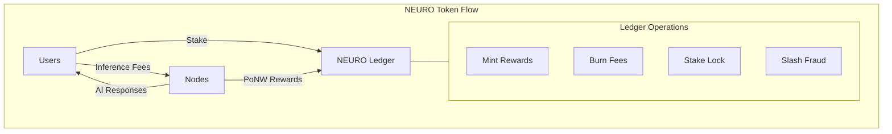

# NEURO Token Economics

The NEURO token powers the NeuroShard ecosystem, aligning incentives between compute providers, validators, and users.

::: tip Mathematical Details
For complete mathematical derivations of all economic formulas, see [Mathematical Foundations](/architecture/mathematical-foundations).
:::

## Token Overview



## Token Properties

| Property | Value |
|----------|-------|
| Name | NEURO |
| Symbol | NEURO |
| Decimals | 18 |
| Initial Supply | 0 (zero pre-mine) |
| Max Supply | Unlimited (controlled emission) |
| Emission | Via Proof of Neural Work |

## Token Utility

### 1. Reward Currency

Nodes earn NEURO for contributing compute:

```python
# Reward calculation
def calculate_reward(
    proof: PoNWProof,
    role: NodeRole,
    stake_amount: float,
    stake_duration: int
) -> float:
    """Calculate NEURO reward for valid PoNW proof."""
    
    # Base reward from work
    base_reward = BASE_REWARD_RATE * proof.compute_units
    
    # Role multiplier
    role_multiplier = ROLE_REWARDS[role]  # Driver: 1.0, Worker: 0.8, Validator: 1.2
    
    # Stake multiplier (diminishing returns)
    stake_multiplier = calculate_stake_multiplier(stake_amount, stake_duration)
    
    # Final reward
    return base_reward * role_multiplier * stake_multiplier
```

### 2. Payment Currency

Users pay NEURO for inference:

```python
# Inference pricing
def calculate_inference_price(
    tokens_generated: int,
    model_size: int,
    priority: str
) -> float:
    """Calculate cost for inference request."""
    
    base_price = tokens_generated * PRICE_PER_TOKEN
    
    # Model size premium
    size_factor = 1.0 + (model_size / 10_000_000_000)  # Premium for larger models
    
    # Priority pricing
    priority_multiplier = {
        "low": 0.5,
        "normal": 1.0,
        "high": 2.0,
        "urgent": 5.0
    }[priority]
    
    return base_price * size_factor * priority_multiplier
```

### 3. Staking Security

Stake NEURO to become a validator:

```python
# Staking requirements
MIN_STAKE_AMOUNT = 1000.0     # Minimum stake for validator
MAX_STAKE_AMOUNT = 1000000.0  # Cap for diminishing returns
MIN_STAKE_DURATION = 7        # Minimum days locked
MAX_STAKE_DURATION = 365      # Maximum days for bonus
```

### 4. Governance (Future)

Token holders will be able to:
- Vote on protocol upgrades
- Adjust economic parameters
- Allocate treasury funds

## Emission Schedule

NEURO is minted exclusively through Proof of Neural Work:

| Year | Emission | Notes |
|------|----------|-------|
| Year 1 | ~100M NEURO | High incentives for early adopters |
| Year 2 | ~150M NEURO | Network growth phase |
| Year 3+ | Variable | Based on network activity |

### Emission Formula

The block reward follows a **halving schedule** with network size adjustment:

$$
R_{\text{block}}(h, N) = R_0 \times 2^{-\lfloor h/H \rfloor} \times \left(1 + \frac{\log_2(N + 1)}{10}\right)
$$

Where:
- $R_0$ = initial block reward
- $h$ = block height
- $H$ = halving period (6,000,000 blocks ≈ 2 years)
- $N$ = number of active nodes

**Halving Schedule:**

| Period | Blocks | Base Reward |
|--------|--------|-------------|
| Year 1-2 | 0 - 6M | $R_0$ |
| Year 3-4 | 6M - 12M | $R_0/2$ |
| Year 5-6 | 12M - 18M | $R_0/4$ |
| Year 7+ | 18M+ | $R_0/8$ ... |

```python
def calculate_block_reward(block_height: int, network_size: int) -> float:
    """Calculate reward for a block based on network state."""
    
    # Base emission (halves every 2 years, ~6M blocks)
    halving_period = 6_000_000
    halvings = block_height // halving_period
    base = INITIAL_BLOCK_REWARD * (0.5 ** halvings)
    
    # Network size adjustment (more nodes = more total rewards)
    size_factor = math.log2(network_size + 1) / 10
    
    return base * (1 + size_factor)
```

## Deflationary Mechanisms

### 1. Fee Burn

A portion of inference fees is burned, creating **deflationary pressure**:

$$
B = F \times r_{\text{burn}}
$$

Where $r_{\text{burn}} = 0.10$ (10%).

**Net token flow** for a fee $F$:

$$
\Delta_{\text{supply}} = R_{\text{minted}} - B = R_{\text{minted}} - 0.10 \times F
$$

When $F > 10 \times R_{\text{minted}}$, the network becomes **net deflationary**.

```python
FEE_BURN_RATE = 0.1  # 10% of fees burned

def process_inference_fee(fee: float) -> Tuple[float, float]:
    """Split fee between burn and node rewards."""
    burn_amount = fee * FEE_BURN_RATE
    reward_amount = fee * (1 - FEE_BURN_RATE)
    return burn_amount, reward_amount
```

### 2. Slashing

Misbehaving nodes lose staked tokens:

```python
SLASH_AMOUNT = 100.0          # NEURO slashed per fraud
SLASH_COOLDOWN = 3600         # Seconds between slashes

def slash_node(node_id: str, reason: str) -> float:
    """Slash a misbehaving node."""
    stake = get_stake(node_id)
    slash = min(SLASH_AMOUNT, stake * 0.1)  # Max 10% of stake
    
    # Burn slashed tokens
    burn(slash)
    reduce_stake(node_id, slash)
    
    logger.warning(f"Slashed {node_id}: {slash} NEURO for {reason}")
    return slash
```

### 3. Stake Lock

Staked tokens are locked, reducing circulating supply:

$$
S_{\text{circulating}} = S_{\text{minted}} - S_{\text{burned}} - S_{\text{staked}}
$$

The **effective supply** available for trading/transfer is always less than total minted.

```python
def calculate_circulating_supply() -> float:
    """Calculate tokens in circulation."""
    total_minted = get_total_minted()
    total_burned = get_total_burned()
    total_staked = get_total_staked()
    
    return total_minted - total_burned - total_staked
```

## Role Distribution

Rewards are distributed based on role:

```python
# Role reward multipliers
ROLE_REWARDS = {
    "driver": 1.0,     # Data preprocessing
    "worker": 0.8,     # Layer computation
    "validator": 1.2,  # Proof verification
}

# Reward distribution for inference request
def distribute_inference_reward(
    total_reward: float,
    participants: Dict[str, str]  # node_id -> role
) -> Dict[str, float]:
    """Distribute reward among participants."""
    
    total_weight = sum(ROLE_REWARDS[role] for role in participants.values())
    
    return {
        node_id: (ROLE_REWARDS[role] / total_weight) * total_reward
        for node_id, role in participants.items()
    }
```

## Stake Mechanics

### Staking Rewards

Stakers earn bonus rewards:

```python
def calculate_stake_multiplier(
    stake_amount: float,
    stake_duration_days: int
) -> float:
    """
    Calculate reward multiplier from stake.
    
    Uses diminishing returns to prevent whale dominance.
    """
    # Amount component (logarithmic)
    if stake_amount <= 0:
        amount_mult = 1.0
    else:
        # log2(stake/100 + 1) capped at 2x
        amount_mult = 1.0 + min(1.0, math.log2(stake_amount / 100 + 1) / 10)
    
    # Duration component (linear up to cap)
    duration_mult = 1.0 + min(0.5, stake_duration_days / 365 * 0.5)
    
    return amount_mult * duration_mult

# Examples:
# 0 stake, 0 days   -> 1.0x
# 1000 stake, 30 days -> 1.34x
# 10000 stake, 180 days -> 1.67x
# 100000 stake, 365 days -> 1.93x (cap)
```

### Unstaking

Tokens have a cooldown period:

```python
UNSTAKE_COOLDOWN_DAYS = 7

async def request_unstake(node_id: str, amount: float):
    """Initiate unstaking process."""
    stake = get_stake(node_id)
    
    if amount > stake:
        raise ValueError("Insufficient stake")
    
    if amount < stake and (stake - amount) < MIN_STAKE_AMOUNT:
        raise ValueError("Remaining stake below minimum")
    
    # Create pending unstake
    create_pending_unstake(
        node_id=node_id,
        amount=amount,
        unlock_time=datetime.now() + timedelta(days=UNSTAKE_COOLDOWN_DAYS)
    )
```

## Validator Requirements (Dynamic Scaling)

Validator stake requirements **scale automatically** with network size:

```python
# Dynamic stake tiers - increases as network grows
VALIDATOR_STAKE_TIERS = [
    (10, 100.0),       # 1-10 validators: 100 NEURO
    (50, 250.0),       # 11-50 validators: 250 NEURO
    (200, 500.0),      # 51-200 validators: 500 NEURO
    (1000, 1000.0),    # 201-1000 validators: 1,000 NEURO
    (inf, 2500.0),     # 1000+ validators: 2,500 NEURO
]

def get_dynamic_validator_stake(num_validators: int) -> float:
    """Get required stake based on current network size."""
    for max_validators, required_stake in VALIDATOR_STAKE_TIERS:
        if num_validators <= max_validators:
            return required_stake
    return 2500.0  # Maximum tier
```

::: tip Why Dynamic Scaling?
This approach provides the **best of both worlds**:

| Network State | Stake | Benefit |
|--------------|-------|---------|
| Bootstrap (1-10) | 100 NEURO | Accessible, encourages early adoption |
| Mature (1000+) | 2,500 NEURO | Economic security at scale |

Security comes from **Byzantine-tolerant aggregation** (Krum, Trimmed Mean), not just high stakes.
The dynamic scaling adds economic deterrence as the network grows.
:::

## Economic Constants

All economic parameters in `constants.py`:

```python
# === Reward Rates ===
UPTIME_REWARD_PER_MINUTE = 0.0001     # ~0.14 NEURO/day idle
TRAINING_REWARD_PER_BATCH = 0.0005    # ~43 NEURO/day active

# === Role Bonuses ===
DRIVER_BONUS = 1.2                    # 20% bonus (Layer 0)
VALIDATOR_BONUS = 1.3                 # 30% bonus (LM head)
WORKER_LAYER_BONUS = 0.05             # 5% per layer held

# === Staking ===
MIN_STAKE_AMOUNT = 1.0                # 1 NEURO minimum
MAX_STAKE_AMOUNT = 10_000_000.0       # 10M NEURO cap
MIN_STAKE_DURATION_DAYS = 1           # 1 day minimum lock
MAX_STAKE_DURATION_DAYS = 365         # 1 year maximum lock

# === Validator Requirements (DYNAMIC!) ===
VALIDATOR_BASE_STAKE = 100.0          # Starting at 100 NEURO
VALIDATOR_MIN_MEMORY_MB = 2000        # 2GB RAM
# Scales to 2500 NEURO at 1000+ validators

# === Fee Mechanics ===
FEE_BURN_RATE = 0.05                  # 5% burned (deflationary)
SLASH_AMOUNT = 10.0                   # Base slash
VALIDATOR_SLASH_MULTIPLIER = 2.0      # 2x for validators (20 NEURO)

# === Anti-Cheat ===
MAX_PROOFS_PER_HOUR = 120             # Rate limit
PROOF_FRESHNESS_WINDOW = 300          # 5 minute validity
```

## Inference Market

Users interact with nodes via the inference market:

```python
class InferenceMarket:
    """Marketplace for inference requests."""
    
    async def submit_request(
        self,
        user_id: str,
        prompt: str,
        max_tokens: int,
        priority: str = "normal"
    ) -> InferenceResult:
        """Submit inference request and pay fees."""
        
        # Estimate cost
        estimated_cost = self.estimate_cost(max_tokens, priority)
        
        # Check balance
        balance = self.ledger.get_balance(user_id)
        if balance < estimated_cost:
            raise InsufficientBalance(balance, estimated_cost)
        
        # Reserve funds
        self.ledger.reserve(user_id, estimated_cost)
        
        # Route request
        result = await self.router.route_inference(prompt, max_tokens)
        
        # Calculate actual cost
        actual_cost = self.calculate_cost(
            tokens_generated=result.token_count,
            priority=priority
        )
        
        # Process payment
        self.ledger.finalize_payment(
            user_id=user_id,
            reserved=estimated_cost,
            actual=actual_cost,
            recipients=result.participants
        )
        
        return result
```

## Next Steps

- [Mathematical Foundations](/architecture/mathematical-foundations) — Complete mathematical derivations
- [Proof of Neural Work](/guide/proof-of-neural-work) — How rewards are earned
- [Staking Guide](/economics/staking) — How to stake NEURO
- [Running a Node](/guide/running-a-node) — Join the network
