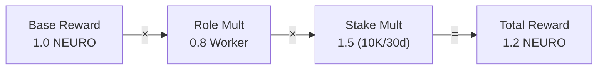
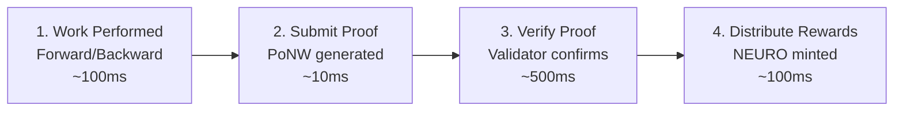
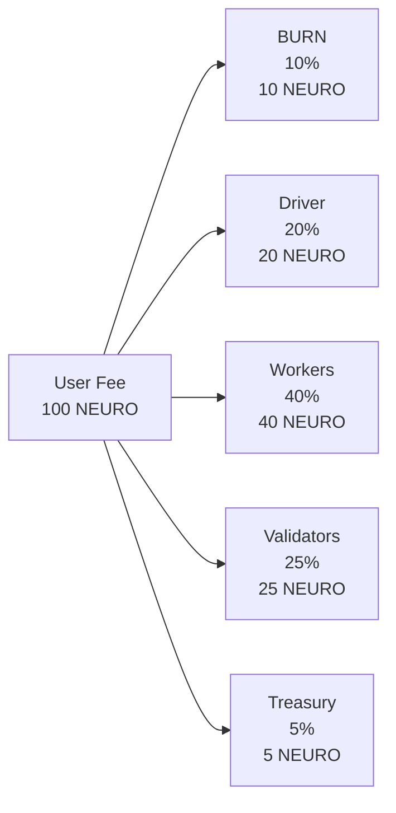

# Reward System

Understand how NEURO rewards are calculated and distributed.

## Reward Overview

The total reward follows the multiplicative formula:

$$
R_{\text{total}} = R_{\text{base}} \times M_{\text{role}} \times M_{\text{stake}}
$$



## Reward Components

### 1. Base Reward

Determined by the Proof of Neural Work submitted:

```python
BASE_REWARD_RATE = 1.0  # NEURO per compute unit

def calculate_base_reward(proof: PoNWProof) -> float:
    """Calculate base reward from proof."""
    
    # Compute units based on operation type and size
    compute_units = proof.compute_units
    
    # Apply network-wide rate
    return BASE_REWARD_RATE * compute_units


# Compute units by operation:
COMPUTE_UNITS = {
    "forward_layer": 1.0,      # Standard layer forward
    "backward_layer": 1.5,     # Backward pass (more compute)
    "gradient_sync": 0.5,      # DiLoCo sync
    "validation": 2.0,         # Proof validation
    "checkpoint": 0.3,         # Checkpoint save/load
}
```

### 2. Role Multiplier

Different roles have different reward rates:

```python
ROLE_REWARDS = {
    "driver": 1.0,      # Data preparation, embedding
    "worker": 0.8,      # Layer computation
    "validator": 1.2,   # Proof verification
}
```

| Role | Multiplier | Responsibilities |
|------|------------|-----------------|
| Driver | 1.0x | Tokenization, embedding, orchestration |
| Worker | 0.8x | Layer forward/backward computation |
| Validator | 1.2x | PoNW verification, consensus |

### 3. Stake Multiplier

The stake multiplier uses **logarithmic scaling** to prevent whale dominance while rewarding commitment.

#### Mathematical Formula

$$
M_{\text{stake}}(s, d) = 1 + M_{\text{amount}}(s) \times (1 + M_{\text{duration}}(d))
$$

Where:

**Amount Component** (logarithmic, capped at 1.0):
$$
M_{\text{amount}}(s) = \min\left(1.0, \frac{\log_2(1 + s/1000)}{10}\right)
$$

**Duration Component** (linear, capped at 0.5):
$$
M_{\text{duration}}(d) = \min\left(0.5, \frac{d}{365} \times 0.5\right)
$$

#### Why Logarithmic?

The logarithmic function provides **diminishing returns**:
- Doubling your stake doesn't double your multiplier
- Prevents wealthy nodes from dominating the network
- Small stakers still receive meaningful benefits

$$
\frac{\partial M_{\text{stake}}}{\partial s} = \frac{1}{10 \ln(2) \cdot (1 + s/1000)} \cdot \frac{1}{1000} \xrightarrow{s \to \infty} 0
$$

#### Implementation

```python
def calculate_stake_multiplier(
    stake_amount: float,
    stake_duration_days: int
) -> float:
    """Calculate stake-based reward multiplier."""
    
    # Amount component (logarithmic, capped)
    if stake_amount <= 0:
        amount_mult = 0.0
    else:
        # log2(stake/100 + 1) / 10, capped at 1.0
        amount_mult = min(1.0, math.log2(stake_amount / 100 + 1) / 10)
    
    # Duration component (linear, capped at 0.5)
    duration_mult = min(0.5, stake_duration_days / 365 * 0.5)
    
    # Combined multiplier: 1.0 to 2.0 range
    return 1.0 + amount_mult * (1.0 + duration_mult)
```

#### Examples

| Stake (NEURO) | $M_{\text{amount}}$ | $M_{\text{stake}}$ |
|---------------|---------------------|-------------------|
| 0 | 0.00 | **1.00×** |
| 1,000 | 0.10 | **1.10×** |
| 2,000 | 0.16 | **1.16×** |
| 10,000 | 0.35 | **1.35×** |
| 100,000 | 0.66 | **1.66×** |

::: info
Duration affects lock period only, not the multiplier.
:::

## Reward Distribution

### Inference Rewards

When an inference request is processed:

```python
async def distribute_inference_reward(
    request: InferenceRequest,
    result: InferenceResult,
    participants: Dict[str, NodeRole]
) -> Dict[str, float]:
    """Distribute rewards for inference request."""
    
    # Calculate total reward pool
    base_pool = result.tokens_generated * BASE_REWARD_RATE
    
    # Add fee contribution (after burn)
    fee_contribution = request.fee * (1 - FEE_BURN_RATE)
    total_pool = base_pool + fee_contribution
    
    # Calculate weighted shares
    shares = {}
    total_weight = 0
    
    for node_id, role in participants.items():
        stake = get_stake(node_id)
        duration = get_stake_duration(node_id)
        
        role_mult = ROLE_REWARDS[role]
        stake_mult = calculate_stake_multiplier(stake, duration)
        
        weight = role_mult * stake_mult
        shares[node_id] = weight
        total_weight += weight
    
    # Distribute proportionally
    rewards = {
        node_id: (weight / total_weight) * total_pool
        for node_id, weight in shares.items()
    }
    
    return rewards
```

### Training Rewards

Rewards for contributing to model training:

```python
def distribute_training_reward(
    epoch: int,
    gradients: Dict[str, torch.Tensor],
    contributors: List[str]
) -> Dict[str, float]:
    """Distribute rewards for training contribution."""
    
    # Base pool from network emission
    base_pool = calculate_epoch_emission(epoch)
    
    # Weight by gradient contribution quality
    quality_scores = {}
    for node_id in contributors:
        # Score based on gradient acceptance rate
        accepted = get_accepted_gradients(node_id, epoch)
        total = get_submitted_gradients(node_id, epoch)
        quality_scores[node_id] = accepted / max(1, total)
    
    # Apply stake multipliers
    weighted_scores = {}
    for node_id, quality in quality_scores.items():
        stake_mult = get_stake_multiplier(node_id)
        weighted_scores[node_id] = quality * stake_mult
    
    # Distribute
    total_weight = sum(weighted_scores.values())
    return {
        node_id: (score / total_weight) * base_pool
        for node_id, score in weighted_scores.items()
    }
```

## Reward Timeline



## Reward Cap and Rate Limits

### Anti-Gaming Measures

```python
# Rate limits to prevent gaming
MAX_PROOFS_PER_HOUR = 1000          # Per node
MIN_PROOF_INTERVAL = 0.1            # Seconds between proofs
MAX_REWARD_PER_PROOF = 10.0         # NEURO cap per proof

def validate_proof_rate(node_id: str) -> bool:
    """Check if node is within rate limits."""
    
    recent_proofs = get_recent_proofs(node_id, hours=1)
    
    if len(recent_proofs) >= MAX_PROOFS_PER_HOUR:
        return False
    
    if recent_proofs:
        last_proof_time = recent_proofs[-1].timestamp
        if time.time() - last_proof_time < MIN_PROOF_INTERVAL:
            return False
    
    return True
```

### Reputation Factor

Long-term contributors earn more:

```python
def calculate_reputation_bonus(node_id: str) -> float:
    """Calculate reputation-based bonus."""
    
    reputation = get_reputation(node_id)
    
    # Reputation 0-100: 0.5x to 1.0x
    # Reputation 100-1000: 1.0x to 1.5x
    if reputation < 100:
        return 0.5 + (reputation / 100) * 0.5
    else:
        return 1.0 + min(0.5, (reputation - 100) / 900 * 0.5)


# Reputation grows with:
# - Successful proof submissions
# - Uptime
# - Valid gradient contributions
# - Validator accuracy

# Reputation decays with:
# - Time (slow decay)
# - Failed proofs
# - Slashing events
```

## Earnings Estimator

### Worker Node

```
Assumptions:
- 8 GPU hours/day
- 10,000 NEURO staked for 30 days
- 95% uptime
- Worker role

Calculation:
- Base compute units: 8 hours x 3600 seconds x 0.1 units/second = 2,880 units/day
- Base reward: 2,880 x 1.0 NEURO = 2,880 NEURO/day
- Role multiplier: 0.8x
- Stake multiplier: 1.50x
- Daily reward: 2,880 x 0.8 x 1.50 = 3,456 NEURO/day

Monthly (30 days): ~103,680 NEURO
```

### Validator Node

```
Assumptions:
- 24/7 uptime
- 50,000 NEURO staked for 180 days
- 99% accuracy
- Validator role

Calculation:
- Base compute units: 24 x 3600 x 0.2 = 17,280 units/day
- Base reward: 17,280 x 1.0 = 17,280 NEURO/day
- Role multiplier: 1.2x
- Stake multiplier: 1.75x
- Daily reward: 17,280 x 1.2 x 1.75 = 36,288 NEURO/day

Monthly (30 days): ~1,088,640 NEURO
```

## Reward Tracking

### Via CLI

```bash
neuroshard rewards summary

# Output:
# ╔════════════════════════════════════════════════════════════╗
# ║                   Rewards Summary                          ║
# ╠════════════════════════════════════════════════════════════╣
# ║ Today:            2,847.32 NEURO                           ║
# ║ This Week:        19,543.21 NEURO                          ║
# ║ This Month:       78,234.56 NEURO                          ║
# ║ Total Earned:     234,567.89 NEURO                         ║
# ╠════════════════════════════════════════════════════════════╣
# ║ Current Rate:     118.64 NEURO/hour                        ║
# ║ Role:             Worker (0.8x)                            ║
# ║ Stake Mult:       1.50x                                    ║
# ║ Effective Mult:   1.20x                                    ║
# ╚════════════════════════════════════════════════════════════╝
```

### Via API

```python
# Get reward history
response = requests.get(
    "https://api.neuroshard.com/v1/rewards",
    headers={"Authorization": f"Bearer {token}"},
    params={
        "node_id": node_id,
        "start_date": "2024-12-01",
        "end_date": "2024-12-31"
    }
)

rewards = response.json()
# {
#   "total": 78234.56,
#   "by_day": [
#     {"date": "2024-12-01", "amount": 2543.21, "proofs": 1847},
#     {"date": "2024-12-02", "amount": 2612.34, "proofs": 1923},
#     ...
#   ],
#   "by_type": {
#     "inference": 45678.90,
#     "training": 32555.66
#   }
# }
```

## Fee Distribution

When users pay for inference, the fee $F$ is distributed according to:

$$
F = F_{\text{burn}} + F_{\text{driver}} + F_{\text{workers}} + F_{\text{validators}} + F_{\text{treasury}}
$$

### Distribution Formula

For a fee of $F$ NEURO:

| Recipient | Share | Formula | Purpose |
|-----------|-------|---------|---------|
| **Burn** | 10% | $F_b = 0.10 \times F$ | Deflationary pressure |
| **Driver** | 20% | $F_d = 0.20 \times F$ | Request orchestration |
| **Workers** | 40% | $F_w = 0.40 \times F$ | Computation |
| **Validators** | 25% | $F_v = 0.25 \times F$ | Verification |
| **Treasury** | 5% | $F_t = 0.05 \times F$ | Protocol development |

**Verification**: $0.10 + 0.20 + 0.40 + 0.25 + 0.05 = 1.00$ ✓



### Worker Distribution (Among Multiple Workers)

When multiple workers process a request, the worker share is distributed proportionally to layers computed:

$$
F_{w_i} = F_w \times \frac{L_i}{\sum_j L_j}
$$

Where $L_i$ is the number of layers processed by worker $i$.

```python
FEE_DISTRIBUTION = {
    "burn": 0.10,        # Deflationary pressure
    "driver": 0.20,      # Request orchestration
    "workers": 0.40,     # Computation
    "validators": 0.25,  # Verification
    "treasury": 0.05,    # Protocol development
}
```

## Next Steps

- [Mathematical Foundations](/architecture/mathematical-foundations) — Complete mathematical derivations
- [Staking Guide](/economics/staking) — Maximize multipliers
- [Proof of Neural Work](/guide/proof-of-neural-work) — Earn proofs
- [Running a Node](/guide/running-a-node) — Start earning
