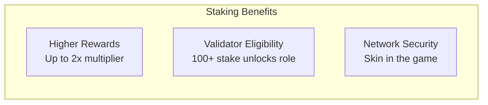
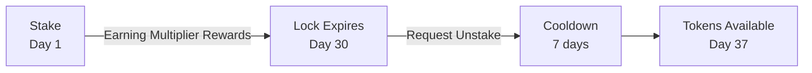
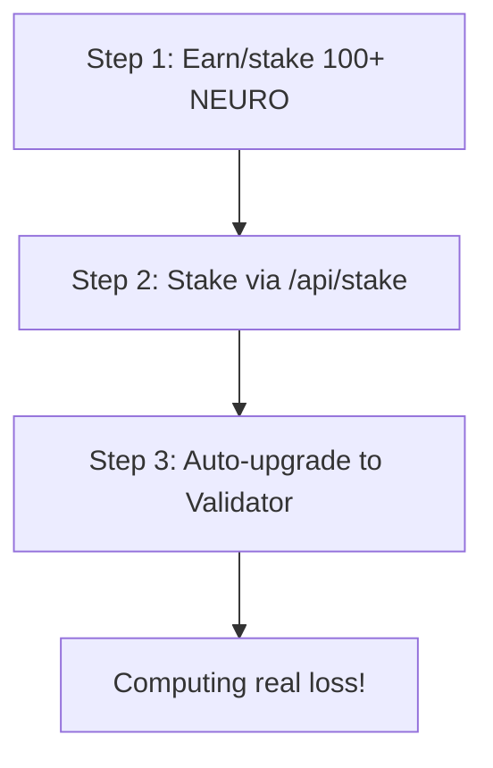
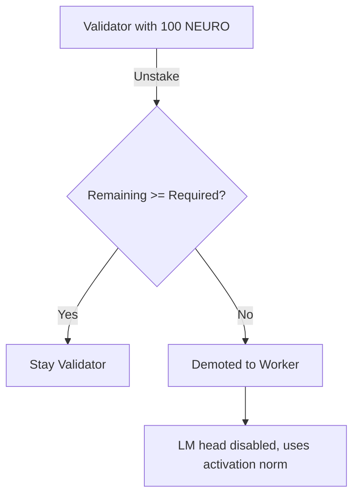

# Staking Guide

Stake NEURO tokens to earn higher rewards, become a validator, and secure the network.

## Why Stake?



### Reward Multipliers

| Stake Amount | Multiplier |
|--------------|------------|
| 0 NEURO | 1.00x |
| 1,000 NEURO | 1.10x |
| 2,000 NEURO | 1.16x |
| 10,000 NEURO | 1.35x |
| 100,000 NEURO | 1.66x |

::: info Duration and Lock Period
The lock duration (7-365 days) determines when you can unstake, but does **not** affect the multiplier. The multiplier depends only on stake amount.
:::

## How to Stake

### Step 1: Get NEURO Tokens

Earn NEURO by running a node or acquire through:
- Running a worker node
- Trading on exchanges (when available)
- Receiving from other users

### Step 2: Initiate Stake

```bash
# Via CLI
neuroshard stake --amount 10000 --duration 30

# Output:
# ✓ Staking 10,000 NEURO for 30 days
# ✓ New reward multiplier: 1.50x
# ✓ Unlock date: 2025-01-04
```

### Step 3: Verify Stake

```bash
# Check stake status
neuroshard stake status

# Output:
# Staked: 10,000 NEURO
# Duration: 30 days
# Started: 2024-12-04
# Unlocks: 2025-01-04
# Multiplier: 1.50x
```

## Staking Tiers

### Tier 1: Worker (0+ NEURO)

**Requirements**: None

**Benefits**:
- Participate as worker node
- Earn base rewards
- Build reputation

### Tier 2: Enhanced Worker (1,000+ NEURO)

**Requirements**: 
- 1,000 NEURO staked
- 7+ days lock

**Benefits**:
- Up to 1.5x reward multiplier
- Priority task assignment
- Enhanced reputation building

### Tier 3: Validator (DYNAMIC Stake)

**Requirements**:
- **Dynamic stake** based on network size (see table below)
- 1+ day lock
- 2GB+ memory

**Benefits**:
- Computes real cross-entropy loss (LM head)
- 1.3x validator bonus on rewards
- Validation rewards (0.001 NEURO/proof)
- Real training impact

### Dynamic Validator Stake (Auto-Scaling)

The validator stake requirement **scales automatically** with network size:

| Network Size | Required Stake | Rationale |
|--------------|----------------|-----------|
| 1-10 validators | **100 NEURO** | Bootstrap phase - accessible |
| 11-50 validators | **250 NEURO** | Growing network |
| 51-200 validators | **500 NEURO** | Established network |
| 201-1000 validators | **1,000 NEURO** | Mature network |
| 1000+ validators | **2,500 NEURO** | Large scale - security focus |

::: tip Why Dynamic Scaling?
- **Few nodes**: Low barrier encourages participation
- **Many nodes**: Higher stakes provide economic security
- **Automatic**: No governance votes needed to adjust
- **Predictable**: Everyone knows the tiers in advance
:::

```python
# The actual code
VALIDATOR_STAKE_TIERS = [
    (10, 100.0),       # Bootstrap
    (50, 250.0),       # Growing  
    (200, 500.0),      # Established
    (1000, 1000.0),    # Mature
    (inf, 2500.0),     # Large scale
]
```

## Staking Mechanics

### Diminishing Returns

Rewards scale **logarithmically** to prevent whale dominance:

$$
M_{\text{stake}}(s) = 1 + \frac{\log_2(1 + s/1000)}{10}
$$

Where $s$ = stake amount in NEURO.

**Why logarithmic?** The derivative decreases as stake increases:

$$
\frac{\partial M}{\partial s} = \frac{1}{10 \ln(2) \cdot (1 + s/1000) \cdot 1000} \xrightarrow{s \to \infty} 0
$$

The curve flattens significantly after 100K stake, meaning additional stake beyond that provides minimal additional benefit.

### Lock Period

Staked tokens are locked for the specified duration:

```python
# Lock periods
MIN_STAKE_DURATION = 1     # day (minimum)
MAX_STAKE_DURATION = 365   # days (maximum)
```

::: tip
The lock period protects the network by ensuring validators have "skin in the game" - they can't unstake immediately if they misbehave.
:::

### Unstaking Cooldown

After lock expires, unstaking requires a 7-day cooldown:



## Slashing

Misbehavior results in stake loss:

### Slashing Conditions

| Offense | Slash Amount | Cooldown |
|---------|--------------|----------|
| Invalid PoNW proof | 100 NEURO | 1 hour |
| Repeated validation failure | 500 NEURO | 6 hours |
| Byzantine behavior | 1,000 NEURO | 24 hours |
| Sybil attack | 100% of stake | Permanent ban |

### Slashing Process

```python
def slash_for_fraud(node_id: str, offense: str) -> float:
    """Slash a node for fraudulent behavior."""
    
    # Get current stake
    stake = get_stake(node_id)
    if stake == 0:
        return 0
    
    # Calculate slash amount
    slash = min(
        SLASH_AMOUNTS[offense],
        stake * 0.1  # Max 10% per incident
    )
    
    # Apply slash
    reduce_stake(node_id, slash)
    burn_tokens(slash)  # Slashed tokens are burned
    
    # Update reputation
    reduce_reputation(node_id, REPUTATION_PENALTIES[offense])
    
    return slash
```

### Avoiding Slashing

1. **Run reliable hardware**: Avoid random failures
2. **Maintain uptime**: Stay connected
3. **Keep software updated**: Use latest node version
4. **Monitor logs**: Watch for errors
5. **Use UPS/stable power**: Prevent unexpected shutdowns

## Validator Path

### Requirements

```python
VALIDATOR_REQUIREMENTS = {
    "min_stake": 100,             # NEURO (accessible threshold)
    "min_memory_mb": 2000,        # 2GB RAM
}
```

### Becoming a Validator



No election needed! Once you have 100+ NEURO staked, your node automatically upgrades to Validator and starts computing real cross-entropy loss.

### Automatic Demotion

:::warning
Validators are **automatically demoted** to Workers if they no longer meet requirements:
:::



**Demotion triggers:**

1. **Unstaking**: If you unstake and your remaining stake drops below the dynamic requirement
2. **Tier change**: As network grows, stake requirement increases:
   - 1-10 validators: 100 NEURO
   - 11-50 validators: 250 NEURO
   - 51-200 validators: 500 NEURO
   - 201-1000 validators: 1,000 NEURO
   - 1000+ validators: 2,500 NEURO

The system checks validator eligibility every 60 seconds and automatically demotes nodes that no longer qualify.

:::tip
When demoted, your node continues as a Worker - you still earn rewards for processing activations, just at a lower rate than Validators.
:::

### Validator Responsibilities

1. **Verify proofs**: Validate PoNW submissions
2. **Finalize blocks**: Participate in consensus
3. **Maintain liveness**: High uptime required
4. **Honest behavior**: Report accurate results

## Role Verification Security

:::danger Important
Nodes **cannot fake their role** to get higher rewards. The system verifies all role claims.
:::

### How Role Verification Works

```python
def verify_node_role(node_id, claimed_embed, claimed_head):
    """
    Verify that a node actually holds the layers it claims.
    Checked against layer_pool assignments (authoritative source of truth).
    """
    layer_0_holders = layer_pool.get_layer_holders(0)
    last_layer_holders = layer_pool.get_layer_holders(last_layer)
    
    actual_embed = node_id in layer_0_holders
    actual_head = node_id in last_layer_holders
    
    # If claims don't match reality → REJECT proof
    if claimed_head and not actual_head:
        return False  # Fake Validator detected!
    if claimed_embed and not actual_embed:
        return False  # Fake Driver detected!
    
    return True
```

### What Happens to Fake Claims

| Fake Claim | Detection | Consequence |
|------------|-----------|-------------|
| `has_lm_head=True` (not Validator) | Cross-ref layer_pool | Proof REJECTED, logged as warning |
| `has_embedding=True` (not Driver) | Cross-ref layer_pool | Proof REJECTED, logged as warning |
| Inflated `layers_held` | Cross-ref layer_pool | Proof REJECTED |
| Fake `training_batches` | Plausibility checks | Proof REJECTED |

### Multi-Layer Security

1. **ECDSA Signatures**: Prove the node sent the proof (can't forge others' proofs)
2. **Role Verification**: Prove the node actually holds claimed layers
3. **Plausibility Checks**: Prove the work is physically possible
4. **Rate Limiting**: Prevent reward inflation
5. **Gossip Consensus**: Cross-validate with other nodes

### Validator Rewards

```python
# Validators earn more per proof
ROLE_VALIDATOR_REWARD = 1.2  # 1.2x base reward

# Plus stake multiplier
total_multiplier = stake_multiplier * role_multiplier

# Example: 10K stake, 30 days, validator
# stake_multiplier = 1.50
# role_multiplier = 1.2
# total_multiplier = 1.80x
```

## CLI Commands

### Check Stake

```bash
neuroshard stake status

# Output:
# ╔════════════════════════════════════════════╗
# ║           Staking Status                   ║
# ╠════════════════════════════════════════════╣
# ║ Staked Amount:     10,000 NEURO            ║
# ║ Lock Duration:     30 days                 ║
# ║ Start Date:        2024-12-04              ║
# ║ Unlock Date:       2025-01-04              ║
# ║ Days Remaining:    26                      ║
# ║ Multiplier:        1.50x                   ║
# ║ Validator Status:  Eligible                ║
# ╚════════════════════════════════════════════╝
```

### Increase Stake

```bash
neuroshard stake add --amount 5000

# Output:
# ✓ Added 5,000 NEURO to stake
# ✓ New total: 15,000 NEURO
# ✓ New multiplier: 1.55x
```

### Extend Duration

```bash
neuroshard stake extend --days 60

# Output:
# ✓ Extended stake by 60 days
# ✓ New unlock date: 2025-03-04
# ✓ New multiplier: 1.68x
```

### Request Unstake

```bash
neuroshard stake unstake --amount 5000

# Output:
# ⏳ Unstake requested for 5,000 NEURO
# ⏳ Cooldown period: 7 days
# ⏳ Available on: 2025-01-11
```

### Claim Unstaked

```bash
neuroshard stake claim

# Output:
# ✓ Claimed 5,000 NEURO
# ✓ Tokens returned to wallet
```

## Staking Strategy

### For New Users

1. **Start small**: Stake 1,000 NEURO for 7 days
2. **Build reputation**: Run reliably for 30 days
3. **Increase stake**: Add more as you earn
4. **Extend duration**: Lock longer for better rewards

### For Power Users

1. **Stake to validator threshold**: 100+ NEURO
2. **Stake more for multiplier**: 1,000+ NEURO = 1.1x, 10,000+ = 1.35x
3. **Maintain uptime**: Invest in reliable hardware
4. **Become a validator**: Compute real loss and earn validation rewards

### Risk Management

- **Don't stake more than you can afford to lose**
- **Diversify**: Run multiple smaller nodes vs one large
- **Monitor slashing**: Watch for warnings
- **Keep reserve**: Don't stake 100% of holdings

## FAQ

### Can I add to my stake during lock period?

Yes, you can add more NEURO at any time. The additional stake inherits the remaining lock duration.

### What happens if I go offline while staked?

Short outages are fine. Extended downtime (>6 hours) affects uptime score. Very long outages (>7 days) may trigger slashing.

### Can I unstake early?

No. The lock period is enforced. Plan your stake duration carefully.

### What if I get slashed?

Slashed tokens are burned. Your remaining stake continues earning. Fix the issue and continue operating.

### How are validators selected?

Validators are selected based on stake weight, uptime, accuracy, and reputation. Top candidates are elected periodically.

## Next Steps

- [Mathematical Foundations](/architecture/mathematical-foundations) — Complete mathematical derivations
- [Running a Node](/guide/running-a-node) — Start earning
- [Proof of Neural Work](/guide/proof-of-neural-work) — How rewards work
- [Token Economics](/economics/overview) — Economic model
