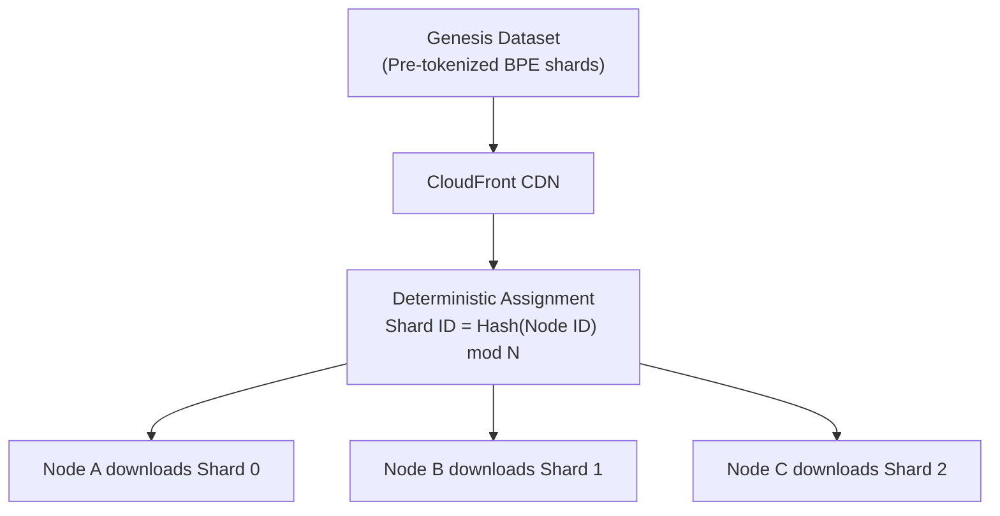
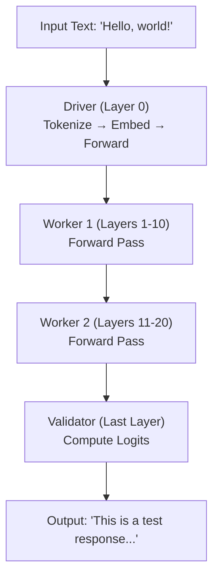
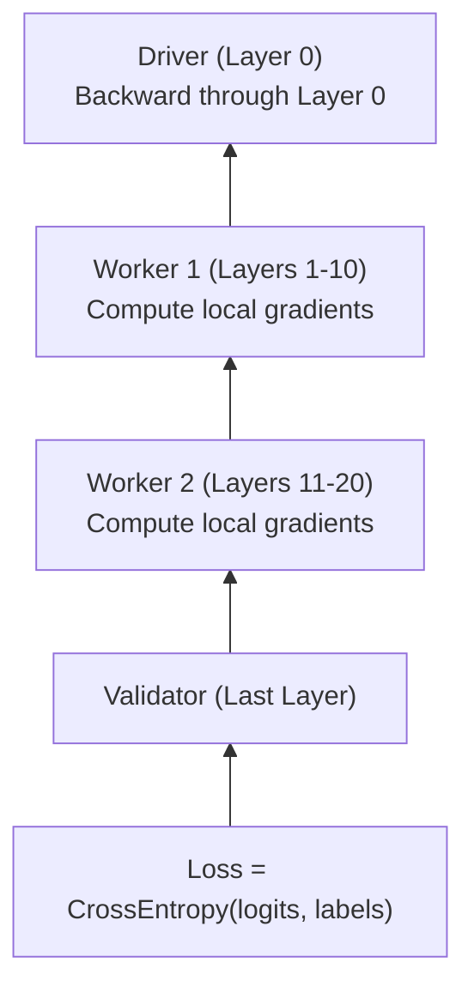
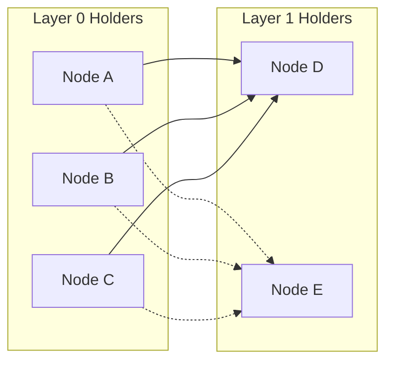
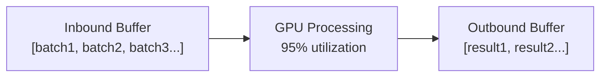

# How It Works

Deep dive into the NeuroShard architecture and how decentralized training actually works.


## The Big Picture

NeuroShard is fundamentally different from traditional AI systems:

| Traditional AI | NeuroShard |
|---------------|------------|
| Model trained in data center | Model trained across global network |
| Company owns the model | Network owns the model |
| Fixed architecture | Dynamic architecture that grows |
| Centralized inference | Distributed inference |
| Opaque training data | Verifiable Genesis Dataset |

## The Training Pipeline

### 1. Genesis Data Sharding

Training data comes from the **Genesis Dataset** — pre-tokenized shards distributed via CloudFront CDN.

::: tip Deep Dive
See [Genesis Data Pipeline](/architecture/genesis-data) and [Tokenization (BPE)](/architecture/tokenization) for complete details.
:::



**Key features**:
- **Pre-tokenized**: Shards contain token IDs, not raw text (2.5M tokens each)
- **BPE vocabulary**: Dynamic vocabulary that grows as more data is processed
- **CDN distributed**: Low-latency global access via CloudFront
- **Verifiable**: Any peer can verify a Driver's work by downloading the same shard

### 2. Forward Pass (Pipeline Parallelism)

When training or doing inference, data flows through the network:



### 3. Backward Pass (Training)

During training, gradients flow backwards:



### 4. DiLoCo: Distributed Low-Communication Training

Here's the magic that makes decentralized training practical:

**Traditional Distributed Training**:
- Sync gradients after EVERY step
- Requires low-latency, high-bandwidth connection
- Impossible on residential internet

**DiLoCo (What NeuroShard Uses)**:
- Each node trains independently for N steps (default: 500)
- Only sync pseudo-gradients periodically
- 500x less communication!

```python
# DiLoCo Inner Loop
w0 = copy(weights)           # Save initial weights
for step in range(500):      # Train locally
    loss = forward(batch)
    loss.backward()
    optimizer.step()

# Compute Pseudo-Gradient
delta = w0 - weights         # What we learned

# Sync with Peers (rarely!)
aggregated_delta = gossip_aggregate(delta)

# Apply Outer Update
weights = w0 + outer_lr * aggregated_delta
```

### 5. Robust Aggregation

When gradients are synchronized, we can't trust all nodes. NeuroShard uses Byzantine-tolerant aggregation:

| Method | Description | Robustness |
|--------|-------------|------------|
| **Mean** | Simple average | Vulnerable to poisoning |
| **Trimmed Mean** | Remove top/bottom 10%, then average | Good |
| **Coordinate Median** | Median of each parameter | Good |
| **Krum** | Select gradient closest to majority | Excellent |
| **Multi-Krum** | Weighted combination of top-k | Excellent |

Example attack scenario:
```
Honest Nodes: gradient = [0.1, 0.2, 0.1, 0.15]
Malicious Node: gradient = [100, -100, 50, -50]  # Poisoning attempt

Simple Mean: [25.1, -24.7, 12.8, -12.4]  # Poisoned!
Trimmed Mean: [0.125, 0.175, 0.1, 0.125]  # Safe!
```

## Dynamic Architecture

### No Fixed Model Sizes

Traditional LLMs have fixed sizes (7B, 13B, 70B). NeuroShard's model grows organically:

| Network Size | Architecture | Params |
|-------------|--------------|--------|
| 10 nodes (40GB) | 16 layers x 1024 dim | 350M |
| 50 nodes (300GB) | 24 layers x 2048 dim | 2.7B |
| 100 nodes (800GB) | 32 layers x 3072 dim | 9.2B |
| 500 nodes (4TB) | 48 layers x 5120 dim | 47B |
| 1000 nodes (8TB) | 64 layers x 7168 dim | 123B |

### Scaling Laws

Architecture follows empirical scaling laws from GPT-3/Chinchilla research:

$$\text{Width} \propto M^{0.6}$$
$$\text{Depth} \propto M^{0.4}$$

Where M is total network memory. Width grows faster than depth (empirically more efficient).

### Architecture Upgrades

The network automatically recalculates optimal architecture:
1. Every 50 nodes joining
2. If improvement >= 30%
3. New nodes use new architecture
4. Existing nodes migrate gradually

## Proof of Neural Work

Every contribution is cryptographically verified:

| Field | Example Value |
|-------|---------------|
| node_id | abc123... |
| timestamp | 1699999999.123456 |
| proof_type | "training" |
| tokens_processed | 50000 |
| training_batches | 120 |
| layers_held | 24 |
| has_embedding | true |
| has_lm_head | false |
| signature | [ECDSA signature] |

Verification steps:
1. **Signature Check**: ECDSA with secp256k1 (same as Bitcoin)
2. **Timestamp**: Must be within 5 minutes
3. **Replay Prevention**: Signature never seen before
4. **Rate Limiting**: Max 120 proofs/hour
5. **Plausibility**: Claimed work is physically possible

## Network Resilience

### Swarm Routing

Unlike brittle pipeline parallelism, NeuroShard uses multipath routing:



If Node D hangs:
- Automatically route to Node E
- No crash, no restart
- 200ms failover

### Activation Buffering

Each node maintains queues to maximize GPU utilization:



Network latency is hidden by always having work ready.

### Speculative Checkpointing

Hot snapshots every 2 minutes:
- Model weights
- Optimizer state
- DiLoCo buffers

On crash: recover in <30 seconds (vs. full restart).

## Economic Incentives

Every action has economic consequences:

| Action | Result |
|--------|--------|
| Compute gradients | Earn NEURO |
| Process inference | Earn NEURO |
| Submit invalid proof | Lose NEURO (slashed) |
| Stake NEURO | Earn bonus multiplier |
| Become Validator | Earn validation fees |

This aligns incentives: the most profitable strategy is to honestly contribute compute.

## Next Steps

- [Mathematical Foundations](/architecture/mathematical-foundations) — Complete mathematical treatment
- [Network Roles](/guide/network-roles) — Deep dive into Driver, Worker, Validator
- [Training Pipeline](/guide/training-pipeline) — Technical training details
- [Proof of Neural Work](/guide/proof-of-neural-work) — PoNW specification
- [Architecture Overview](/architecture/overview) — System design
