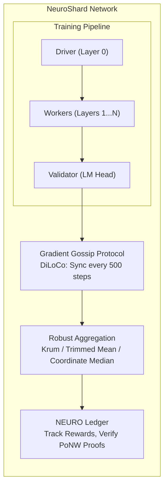

# Introduction

NeuroShard is a **decentralized architecture for collective intelligence** — a protocol that turns a global network of heterogeneous devices into one continuously evolving optimizer that collectively trains a shared model, **NeuroLLM**, from random initialization.

## The Problem with Centralized AI

The current landscape of artificial intelligence is defined by a small number of vertically integrated AI platforms that own the models, the data, and the distribution channels:

- **Centralized Control**: Alignment, safety, and access policies are set unilaterally with limited transparency
- **Infrastructure Barriers**: Training frontier models requires billion-dollar clusters, shutting out independent researchers
- **Compute Waste**: While hyperscale data centers consume enormous energy, the world's edge compute remains unused
- **Data Privacy**: Centralized training creates systemic privacy risks

## The NeuroShard Solution

NeuroShard proposes a decentralized alternative: a protocol for **collaborative model creation** where the network, not any single operator, is the place where the model lives.

### Core Principles

#### 1. Organic Scalability
The model architecture is not fixed but elastic. Using a **Dynamic Layer Pool**, the model expands as new nodes join and contribute memory — no fixed "7B/70B" jumps.

#### 2. Verifiable Computation  
Through **Proof of Neural Work (PoNW)**, the network cryptographically validates that participants are performing useful training operations. Gradients are proofs of work.

#### 3. Byzantine Tolerance
The training process is secured against malicious actors through robust statistics (Krum, Trimmed Mean, Coordinate-wise Median) and a fraud-proof slashing mechanism.

#### 4. Economic Alignment
The NEURO token aligns incentives, rewarding participants for verifiable contributions of compute, data, and uptime. The token is backed by the network's collective computational intelligence.

## NeuroLLM: The Model

NeuroLLM is not a fork or fine-tune of an existing model. It is a completely new transformer architecture designed with specific goals:

| Feature | Description |
|---------|-------------|
| **Efficient Gradients** | Optimized for gradient compression and gossip transmission |
| **Stable Training** | Robust to asynchronous, noisy gradient updates |
| **Scalable Architecture** | Grows from 125M to 70B+ parameters as the network matures |
| **Privacy-Compatible** | Supports differential privacy in training data |

### Architecture Components

- **RMSNorm**: More stable for distributed training than LayerNorm
- **Rotary Position Embeddings (RoPE)**: No fixed maximum sequence length
- **Grouped Query Attention (GQA)**: 3x reduction in KV cache size
- **SwiGLU Activation**: Better gradient flow than ReLU or GELU

## How It Works

## Key Differentiators

| Feature | NeuroShard | Other Systems |
|---------|-----------|---------------|
| **Model Ownership** | Community-owned, trained from scratch | Pre-trained by corporations |
| **Architecture** | Dynamic, grows with network | Fixed model sizes |
| **Training** | Decentralized DiLoCo protocol | Centralized data centers |
| **Rewards** | Proof of Neural Work | Proof of Stake/Output validation |
| **Data** | Genesis dataset (verifiable) | Unknown training data |

## Next Steps

- [Quick Start Guide](/guide/quick-start) — Get your node running in 5 minutes
- [How It Works](/guide/how-it-works) — Deep dive into the technology
- [NEURO Economics](/economics/overview) — Understand rewards and tokenomics
- [Architecture Overview](/architecture/overview) — Technical deep dive
