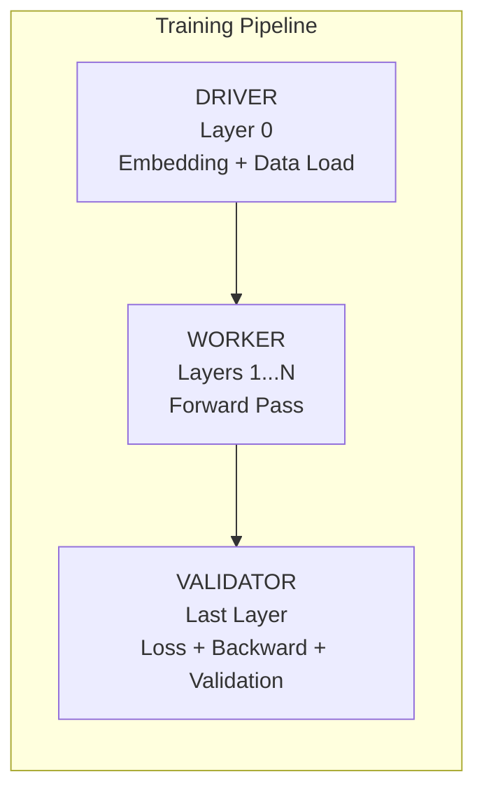
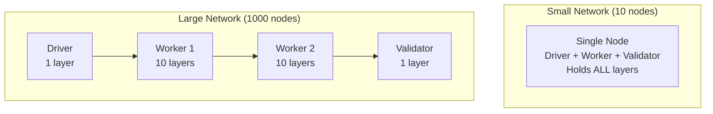

# Network Roles

NeuroShard nodes self-organize into three distinct roles based on their hardware capacity and stake.

## The Three Roles



## Driver (Layer 0)

The **Driver** is the entry point of the training pipeline.

### Responsibilities
- Download and process Genesis Dataset shards
- Tokenize input text
- Compute token embeddings
- Initiate forward pass
- Send activations to Workers

### Requirements
| Requirement | Value |
|-------------|-------|
| Memory | >=2GB (recommended >=8GB) |
| Bandwidth | High (downloads training data) |
| Stake | None required |

### Reward Bonus
- **+20%** (1.2x multiplier) on all rewards
- Compensates for data bandwidth costs

### Verification
Drivers are held accountable through **Genesis Shard Verification**:
```
Shard ID = Hash(Node ID) mod Total_Shards
```
Any peer can:
1. Download the same shard
2. Recompute Layer 0 output
3. Compare hash with Driver's output
4. Report fraud if mismatch

## Worker (Layers 1...N)

The **Worker** performs the bulk of neural network computation.

### Responsibilities
- Receive activations from previous node
- Forward through assigned layers
- Send activations to next node
- Compute gradients for local layers during training

### Requirements
| Requirement | Value |
|-------------|-------|
| Memory | Any (determines layer count) |
| Bandwidth | Moderate |
| Stake | None required |

### Reward Bonus
- **+5% per layer** held (capped at 100% = 2x)
- 10 layers = 1.5x
- 20 layers = 2.0x (max)

### Layer Assignment
Workers are assigned layers based on available memory:

```python
layers_assigned = calculate_layer_assignment(
    available_memory_mb=8000,  # 8GB
    architecture=current_architecture,
    safety_factor=0.6
)
# Returns: ~15-25 layers depending on model size
```

## Validator (Last Layer)

The **Validator** is the exit point and consensus participant.

### Responsibilities
- Hold the LM Head (output projection)
- Compute logits from final hidden states
- Calculate loss during training
- Initiate backward pass
- Verify PoNW proofs from other nodes
- Participate in stake-weighted consensus

### Requirements
| Requirement | Value |
|-------------|-------|
| Memory | >=2GB |
| Stake | **>=100 NEURO** |

::: warning Stake Requirement
Unlike Drivers and Workers, Validators **must stake NEURO** to be eligible. This prevents Sybil attacks on the consensus mechanism.
:::

### Reward Bonus
- **+30%** (1.3x multiplier) on all rewards
- **+0.001 NEURO** per proof validated

### Validator Selection
When a proof needs validation, validators are selected using stake-weighted random selection:

```
Score = Stake x (1 - 0.3) + Random x 0.3 x MaxStake
```

This ensures:
- Higher stake -> higher selection chance
- 30% randomness -> small stakers still get opportunities
- No monopoly by largest stakers

### Validator Slashing
Validators who vote against consensus are **slashed at 2x the normal rate**:

```
Normal Slash:    10 NEURO
Validator Slash: 20 NEURO (2x)
```

100% of validator slashes are burned (not given to reporters).

## Role Assignment Flow

When a node joins, roles are assigned based on capacity:

```python
# Step 1: Check capacity
is_high_capacity = available_memory > 8000  # 8GB
is_medium_capacity = available_memory > 2000  # 2GB

# Step 2: Check stake for Validator
has_validator_stake = staked_amount >= 100  # 100 NEURO

# Step 3: Assign roles
if is_high_capacity or (is_medium_capacity and num_drivers < 2):
    assign_layer_0()  # Become Driver

if has_validator_stake and (is_high_capacity or num_validators < 2):
    assign_last_layer()  # Become Validator

# Step 4: Fill remaining capacity with Worker layers
assign_remaining_layers()
```

## Dual/Triple Roles

In early network stages (few nodes), a single node might hold multiple roles:



This is **temporary** — as more nodes join, layers are redistributed.

## Role Economics

### Earnings by Role

| Role | Base Rate | Bonus | Example Daily (Active) |
|------|-----------|-------|----------------------|
| Driver | Training + Uptime | +20% | ~50-75 NEURO |
| Worker (20 layers) | Training + Uptime | +100% | ~80-120 NEURO |
| Validator | Training + Validation Fees | +30% | ~60-100 NEURO |
| All Three | Combined | Combined | ~120-200 NEURO |

### Optimal Strategy

1. **Low Memory (<4GB)**: Pure Worker, maximize layers
2. **Medium Memory (4-8GB)**: Driver or Worker
3. **High Memory (>8GB)**: Driver + Worker
4. **With 100+ NEURO stake**: Add Validator role

## Checking Your Role

### Via Dashboard
Open `http://localhost:8000/` and check the "Role" field.

### Via API
```bash
curl http://localhost:8000/api/stats | jq '.has_embedding, .has_lm_head'
```

- `has_embedding: true` -> Driver
- `has_lm_head: true` -> Validator
- Otherwise -> Worker

### Via Logs
```
[NODE] Node abc123... became a Driver (Layer 0)
[NODE] Node abc123... became a Validator (Last Layer)
[NODE] Assigned 24 layers: [0, 1, 2, ... 23]
```

## Next Steps

- [Training Pipeline](/guide/training-pipeline) — How training works
- [Proof of Neural Work](/guide/proof-of-neural-work) — PoNW verification
- [Staking](/economics/staking) — How to become a Validator
- [Reward Structure](/economics/rewards) — Maximize earnings
