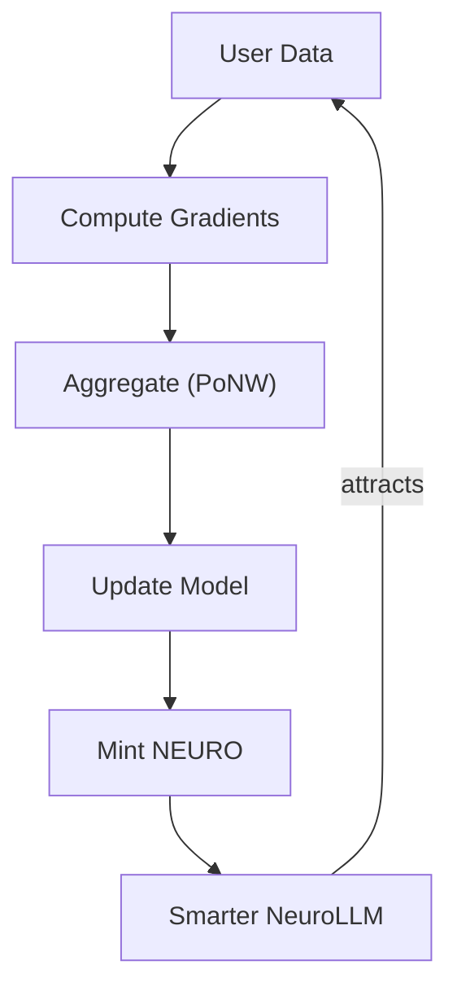

# Proof of Neural Work (PoNW)

The foundational consensus mechanism of NeuroShard that validates useful neural network computation.

## Overview

Unlike traditional blockchain consensus:

| Mechanism | Work Type | Output | Useful? |
|-----------|-----------|--------|---------|
| Proof of Work (PoW) | SHA-256 hashing | Block hash | No |
| Proof of Stake (PoS) | Capital lockup | Nothing | No |
| **Proof of Neural Work** | Neural network training | Model improvement | Yes |

**Key Insight**: Training a neural network is inherently verifiable work. A gradient computed on real data will reduce the model's loss when aggregated with other gradients. Fake gradients will not.

## The PoNW Cycle



## Proof Structure

Every PoNW proof contains:

```python
@dataclass
class PoNWProof:
    # Identity
    node_id: str              # SHA256 of public key
    timestamp: float          # Unix timestamp
    nonce: str                # Random value (replay prevention)
    
    # Work Metrics
    proof_type: str           # "uptime", "inference", "training", "data"
    uptime_seconds: float     # Time online
    tokens_processed: int     # Tokens computed
    training_batches: int     # Training batches completed
    data_samples: int         # Data samples served
    
    # Context
    layers_held: int          # Number of layers
    has_embedding: bool       # Is Driver?
    has_lm_head: bool         # Is Validator?
    model_hash: str           # Hash of model state
    
    # Marketplace (for inference)
    request_id: str           # Links to InferenceRequest
    
    # Cryptographic Signature
    signature: str            # ECDSA signature
```

### Canonical Payload

The proof is signed over a deterministic string:

```python
def canonical_payload(self) -> str:
    return (
        f"{self.node_id}:{self.proof_type}:{self.timestamp:.6f}:{self.nonce}:"
        f"{self.uptime_seconds:.1f}:{self.tokens_processed}:{self.training_batches}:"
        f"{self.data_samples}:{self.request_id or ''}:"
        f"{self.model_hash}:{self.layers_held}"
    )
```

## Cryptographic Security

### ECDSA Signatures

NeuroShard uses ECDSA with secp256k1 (same as Bitcoin/Ethereum):

```python
from ecdsa import SigningKey, SECP256k1

# Key derivation from token
private_key = SHA256(node_token)
signing_key = SigningKey.from_string(private_key, curve=SECP256k1)
public_key = signing_key.get_verifying_key()
node_id = SHA256(public_key)[:32]

# Signing
def sign(payload: str) -> str:
    signature = signing_key.sign(payload.encode())
    return signature.hex()

# Verification (trustless - anyone can verify)
def verify(node_id: str, payload: str, signature: str) -> bool:
    public_key = get_public_key(node_id)  # From DHT
    return public_key.verify(bytes.fromhex(signature), payload.encode())
```

### Why ECDSA over HMAC?

| Feature | HMAC | ECDSA |
|---------|------|-------|
| Verification | Requires shared secret | Uses public key only |
| Trust Model | Trust the verifier | Trustless |
| Decentralization | Central secret needed | Fully decentralized |

## Proof Verification

Every proof goes through multiple verification steps:

### 1. Signature Verification

```python
def verify_signature(proof: PoNWProof) -> bool:
    # Get public key from DHT
    public_key = get_public_key(proof.node_id)
    
    # Verify ECDSA signature
    payload = proof.canonical_payload()
    return ecdsa_verify(public_key, payload, proof.signature)
```

### 2. Timestamp Freshness

```python
def verify_timestamp(proof: PoNWProof) -> bool:
    age = time.time() - proof.timestamp
    
    if age > 300:  # 5 minutes max
        return False, "Proof too old"
    
    if age < -60:  # 1 minute clock skew tolerance
        return False, "Proof from future"
    
    return True, "OK"
```

### 3. Replay Prevention

```python
def verify_not_replay(proof: PoNWProof) -> bool:
    # Check if signature already used
    existing = db.query("SELECT 1 FROM proof_history WHERE signature = ?", 
                        proof.signature)
    
    if existing:
        return False, "Duplicate proof (replay attack)"
    
    return True, "OK"
```

### 4. Rate Limiting

```python
# Constants
MAX_PROOFS_PER_HOUR = 120    # 2 per minute
MAX_TOKENS_PER_MINUTE = 1_000_000

def verify_rate_limits(proof: PoNWProof) -> bool:
    # Check proofs per hour
    recent_proofs = count_proofs(proof.node_id, last_hour=True)
    if recent_proofs >= MAX_PROOFS_PER_HOUR:
        return False, "Rate limit: too many proofs"
    
    # Check tokens per minute
    recent_tokens = count_tokens(proof.node_id, last_minute=True)
    if recent_tokens > MAX_TOKENS_PER_MINUTE:
        return False, "Rate limit: too many tokens"
    
    return True, "OK"
```

### 5. Plausibility Checks

```python
def verify_plausibility(proof: PoNWProof) -> bool:
    # Check uptime claim
    if proof.uptime_seconds > 120:  # Max 2 min per proof
        return False, "Uptime too high"
    
    # Check token rate
    if proof.uptime_seconds > 0:
        tokens_per_second = proof.tokens_processed / proof.uptime_seconds
        max_tps = 1_000_000 / 60  # ~16K tokens/sec max
        if tokens_per_second > max_tps * 2:
            return False, "Token rate implausible"
    
    # Check training rate
    if proof.uptime_seconds > 0:
        batches_per_min = (proof.training_batches / proof.uptime_seconds) * 60
        if batches_per_min > 120:  # 2 batches/sec max
            return False, "Training rate implausible"
    
    return True, "OK"
```

## Proof Types

### Uptime Proof

Minimal proof that the node is online:

```python
proof = create_proof(
    proof_type=ProofType.UPTIME,
    uptime_seconds=60.0,  # 1 minute
    layers_held=24,
    has_embedding=True,
    has_lm_head=False
)
# Reward: ~0.0001 NEURO/minute
```

### Inference Proof

Proof of serving inference requests:

```python
proof = create_proof(
    proof_type=ProofType.INFERENCE,
    tokens_processed=50000,
    request_id="req_abc123",  # Links to marketplace request
    layers_held=24
)
# Reward: Market-based (NEURO per 1M tokens)
```

### Training Proof

Proof of training contribution (dominant reward):

```python
proof = create_proof(
    proof_type=ProofType.TRAINING,
    training_batches=60,
    uptime_seconds=60.0,
    layers_held=24,
    has_embedding=True
)
# Reward: 0.0005 NEURO/batch x 60 = 0.03 NEURO
```

### Data Proof

Proof of serving Genesis Dataset shards:

```python
proof = create_proof(
    proof_type=ProofType.DATA,
    data_samples=10000,
    layers_held=24,
    has_embedding=True
)
# Reward: 0.00001 NEURO/sample
```

## Reward Calculation

### Mathematical Formulation

The total reward for a PoNW proof is computed as:

$$
R_{\text{total}} = R_{\text{base}} \times M_{\text{stake}} \times M_{\text{role}}
$$

Where the **base reward** combines multiple components:

$$
R_{\text{base}} = R_{\text{uptime}} + R_{\text{training}} + R_{\text{data}} + R_{\text{inference}}
$$

**Component Formulas:**

| Component | Formula | Rate |
|-----------|---------|------|
| Uptime | $R_u = \frac{t_{\text{seconds}}}{60} \times 0.0001$ | 0.0001 NEURO/min |
| Training | $R_t = n_{\text{batches}} \times 0.0005$ | 0.0005 NEURO/batch |
| Data | $R_d = n_{\text{samples}} \times 0.00001$ | 0.00001 NEURO/sample |
| Inference | $R_i = \frac{n_{\text{tokens}}}{10^6} \times P_{\text{market}} \times \alpha_{\text{role}}$ | Market-based |

**Role Share ($\alpha_{\text{role}}$) for Inference:**

$$
\alpha_{\text{role}} = \begin{cases}
0.15 & \text{if Driver (has embedding)} \\
0.15 & \text{if Validator (has LM head)} \\
0.70 & \text{if Worker (intermediate layers)}
\end{cases}
$$

### Implementation

```python
def calculate_reward(proof: PoNWProof) -> float:
    # Base rewards
    uptime_reward = (proof.uptime_seconds / 60) * 0.0001
    training_reward = proof.training_batches * 0.0005
    data_reward = proof.data_samples * 0.00001
    
    # Inference reward (market-based)
    if proof.request_id:
        request = get_request(proof.request_id)
        market_price = request.locked_price
    else:
        market_price = get_current_market_price()
    
    inference_reward = (proof.tokens_processed / 1_000_000) * market_price
    
    # Role distribution for inference
    if proof.has_embedding:
        inference_reward *= 0.15  # Driver share
    elif proof.has_lm_head:
        inference_reward *= 0.15  # Validator share
    else:
        inference_reward *= 0.70  # Worker share
    
    base_reward = uptime_reward + training_reward + data_reward + inference_reward
    
    # Multipliers
    stake_multiplier = calculate_stake_multiplier(get_stake(proof.node_id))
    role_multiplier = calculate_role_multiplier(proof)
    
    return base_reward * stake_multiplier * role_multiplier
```

## Attack Prevention

### Freeloading
Cannot earn rewards without running the model and computing real gradients.

### Inflation
Token counts are cross-validated against actual computation time.

### Sybil
Staking requirement (100 NEURO for Validators) makes fake nodes expensive.

### Gradient Poisoning
Robust aggregation and statistical verification reject malicious gradients.

### Replay Attacks
Timestamp windows and signature uniqueness prevent proof reuse.

## Transparency Guarantee

::: warning No Admin Backdoor
There is **NO** admin backdoor. The **ONLY** way to get NEURO is:
1. Run a node that does real work
2. Create a signed proof of that work
3. Pass ALL verification checks
4. Receive rewards proportional to verified work

Even the project creators must run nodes and earn like everyone else.
:::

## Next Steps

- [Mathematical Foundations](/architecture/mathematical-foundations) — Complete mathematical treatment
- [Validator System](/economics/staking) — Stake-weighted consensus
- [Slashing Mechanism](/economics/staking#slashing) — Fraud punishment
- [NEURO Economics](/economics/overview) — Token economics
