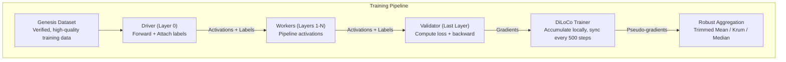
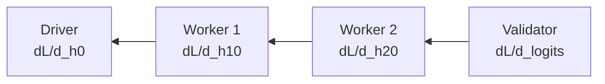

# Training Pipeline

Detailed technical guide to NeuroShard's decentralized training system.

::: tip Mathematical Details
For complete mathematical derivations and proofs, see [Mathematical Foundations](/architecture/mathematical-foundations).
:::

## Overview

NeuroShard uses a hybrid training approach combining:

1. **Pipeline Parallelism**: Layers distributed across nodes
2. **DiLoCo Protocol**: Infrequent synchronization
3. **Robust Aggregation**: Byzantine-tolerant gradient averaging



## Genesis Dataset

Training data is drawn from a cryptographically verified manifest of high-quality datasets, pre-tokenized with BPE and distributed via CDN.

::: tip Deep Dive
For complete details on data processing and tokenization, see:
- [Genesis Data Pipeline](/architecture/genesis-data) — How shards are created
- [Tokenization (BPE)](/architecture/tokenization) — How text becomes tokens
:::

### Available Sources

| Dataset | Description | Target Shards | Status |
|---------|-------------|---------------|--------|
| FineWeb-Edu | Educational web content | 500,000 | ✅ Active |
| FineWeb | General web text | 50,000 | Pending |
| RedPajama | Open reproduction of LLaMA data | 3,000 | Pending |
| SlimPajama | Cleaned CommonCrawl | 2,000 | Pending |
| C4 | Colossal Clean Crawled Corpus | 1,000 | Pending |

### Pre-Tokenized Shards

Unlike traditional systems, NeuroShard shards are **pre-tokenized**:

| Property | Value |
|----------|-------|
| Tokens per shard | 2,500,000 |
| File format | PyTorch tensor (.pt) |
| Tokenizer | BPE (dynamic vocabulary) |
| Distribution | CloudFront CDN |

```python
# Each shard is a tensor of token IDs
shard = torch.load("shard_42.pt")  # Shape: [2,500,000]

# Token types:
# - 0-9: Special tokens (PAD, BOS, EOS, etc.)
# - 10-265: Byte tokens (raw UTF-8 bytes)
# - 266+: BPE merges (learned subword units)
```

### Deterministic Sharding

Each Driver is assigned shards based on their node ID:

```python
shard_id = hash(node_id) % total_shards
```

This enables:
- **Reproducibility**: Same node always gets same data
- **Verification**: Peers can check Driver's work
- **Load Distribution**: Data spread across network

### Data Flow

```python
# Driver node loads pre-tokenized data
class GenesisDataLoader:
    GENESIS_CDN_URL = "https://dwquwt9gkkeil.cloudfront.net"
    
    def __init__(self, node_id):
        self.manifest = self._fetch_manifest()
        self._load_learned_tokenizer()  # Sync BPE vocab from CDN
    
    def download_shard(self, shard_id: int) -> torch.Tensor:
        """Download pre-tokenized shard from CDN."""
        url = f"{self.GENESIS_CDN_URL}/shard_{shard_id}.pt"
        resp = requests.get(url)
        return torch.load(BytesIO(resp.content))
    
    def get_batch(self, shard: torch.Tensor, batch_size=4, seq_len=512):
        # Sample random starting positions
        starts = torch.randint(0, len(shard) - seq_len - 1, (batch_size,))
        
        # Create input/label pairs (no tokenization needed!)
        input_ids = torch.stack([shard[s:s+seq_len] for s in starts])
        labels = torch.stack([shard[s+1:s+seq_len+1] for s in starts])
        
        return input_ids, labels
```

### Tokenizer Synchronization

Training nodes automatically sync their BPE tokenizer from CDN:

```python
def _load_learned_tokenizer(self):
    """Update tokenizer with latest BPE merges."""
    resp = requests.get(f"{self.GENESIS_CDN_URL}/tokenizer.json")
    remote_tok = resp.json()
    
    # Update if remote has more merges
    if remote_tok["next_merge_id"] > self.tokenizer.next_merge_id:
        self.tokenizer.merges = remote_tok["merges"]
        self.tokenizer.next_merge_id = remote_tok["next_merge_id"]
        logger.info(f"Updated tokenizer: {self.tokenizer.current_vocab_size} vocab")
```

This ensures:
- All nodes use the same tokenizer
- User contributions are tokenized consistently
- Vocabulary grows as more data is processed

## Forward Pass

### Mathematical Formulation

The forward pass computes:

$$
\text{logits} = W_{\text{head}} \cdot \text{RMSNorm}\left(\prod_{l=1}^{L} f_l(h_{l-1})\right)
$$

Where each transformer layer $f_l$ applies:

$$
f_l(x) = x + \text{FFN}(\text{RMSNorm}(x + \text{Attention}(\text{RMSNorm}(x))))
$$

### Local Forward (Single Node)

When a node holds all layers:

```python
def forward_local(input_ids):
    # Embed tokens
    hidden = model.embed(input_ids)
    
    # Forward through all layers
    for layer in model.layers:
        hidden, _ = layer(hidden)
    
    # Compute logits
    logits = model.compute_logits(hidden)
    
    return logits
```

### Distributed Forward (Multiple Nodes)

When layers are spread across nodes:

```python
def forward_distributed(input_ids, session_id):
    # Driver: Embed and forward Layer 0
    hidden = model.embed(input_ids)
    hidden = model.layers[0](hidden)
    
    # Send to next node in pipeline
    next_node = get_next_hop(layer_id=1)
    send_activations(next_node, hidden, labels, session_id)
```

Each node receives activations, processes its layers, and forwards to the next:

```python
def handle_pipeline_forward(activations, labels, session_id, sender_url):
    # Forward through my layers
    hidden = model.forward_my_layers(activations)
    
    if model.has_lm_head:
        # I'm the Validator - compute loss
        logits = model.compute_logits(hidden)
        loss = cross_entropy(logits, labels)
        
        # Initiate backward pass
        backward(loss, session_id, sender_url)
    else:
        # Forward to next node
        next_node = get_next_hop(my_last_layer + 1)
        send_activations(next_node, hidden, labels, session_id)
```

## Backward Pass

### Mathematical Formulation

The backward pass computes gradients via chain rule. For loss $\mathcal{L}$:

$$
\frac{\partial \mathcal{L}}{\partial \theta_l} = \frac{\partial \mathcal{L}}{\partial h_L} \cdot \prod_{k=l+1}^{L} \frac{\partial h_k}{\partial h_{k-1}} \cdot \frac{\partial h_l}{\partial \theta_l}
$$

The **cross-entropy loss** for next-token prediction:

$$
\mathcal{L} = -\frac{1}{T}\sum_{t=1}^{T} \log \frac{\exp(z_{y_t})}{\sum_j \exp(z_j)}
$$

Where $z$ are logits and $y_t$ is the true token at position $t$.

### Gradient Computation

The backward pass flows in reverse:

```python
def backward_pass(loss, session_id):
    # Validator computes gradients
    optimizer.zero_grad()
    loss.backward()
    
    # Clip gradients
    clip_grad_norm_(model.parameters(), max_norm=1.0)
    
    # Step optimizer
    optimizer.step()
    
    # Send gradients to previous node
    if session_context[session_id].sender_url:
        send_gradients(sender_url, hidden.grad, session_id)
```

### Gradient Routing



Each node:
1. Receives gradient from next node
2. Backward through local layers
3. Steps local optimizer
4. Sends gradient to previous node

## DiLoCo Protocol

DiLoCo enables training with 500x less communication.

### Inner Loop (Local Training)

Each node trains independently for N steps:

```python
class DiLoCoTrainer:
    def __init__(self, model, inner_steps=500):
        self.inner_steps = inner_steps
        self.initial_weights = {}
    
    def start_inner_loop(self):
        # Save initial weights
        for name, param in model.named_parameters():
            self.initial_weights[name] = param.data.clone()
        self.step_count = 0
    
    def inner_step(self, loss):
        loss.backward()
        optimizer.step()
        optimizer.zero_grad()
        self.step_count += 1
```

### Pseudo-Gradient Computation

After N inner steps, compute the pseudo-gradient:

```python
def compute_pseudo_gradient(self):
    pseudo_grads = {}
    for name, param in model.named_parameters():
        # Delta = what we learned
        delta = self.initial_weights[name] - param.data
        pseudo_grads[name] = delta
    return pseudo_grads
```

### Outer Loop (Synchronization)

Sync with peers and apply outer optimizer:

```python
async def outer_step(self):
    # Compute local pseudo-gradient
    pseudo_grads = self.compute_pseudo_gradient()
    
    # Gossip to peers
    aggregated = await gossip_gradients(pseudo_grads)
    
    # Apply outer optimizer (Nesterov momentum)
    self.outer_optimizer.step(model, aggregated)
    
    # Start new inner loop
    self.start_inner_loop()
```

### Outer Optimizer

Uses Nesterov momentum for better convergence:

```python
class OuterOptimizer:
    def __init__(self, lr=0.7, momentum=0.9):
        self.lr = lr
        self.momentum = momentum
        self.velocity = {}
    
    def step(self, model, pseudo_gradients):
        for name, param in model.named_parameters():
            delta = pseudo_gradients[name]
            
            # Initialize velocity
            if name not in self.velocity:
                self.velocity[name] = torch.zeros_like(delta)
            
            v = self.velocity[name]
            
            # Nesterov update
            v.mul_(self.momentum).add_(delta)
            update = self.lr * (self.momentum * v + delta)
            
            param.data.add_(update)
```

## Robust Aggregation

Protects against malicious gradient contributions.

### Trimmed Mean

Remove top/bottom 10% before averaging:

```python
def trimmed_mean(contributions, trim_fraction=0.1):
    stacked = torch.stack(contributions)  # [n, ...]
    n = len(contributions)
    trim_count = int(n * trim_fraction)
    
    # Sort and trim
    sorted_tensors = stacked.sort(dim=0)[0]
    trimmed = sorted_tensors[trim_count:-trim_count]
    
    return trimmed.mean(dim=0)
```

### Krum

Select gradient closest to majority:

```python
def krum(contributions, num_byzantine=1):
    n = len(contributions)
    
    # Compute pairwise distances
    distances = compute_pairwise_distances(contributions)
    
    # For each gradient, sum distances to n-f-2 closest
    scores = []
    for i in range(n):
        sorted_dists = sorted(distances[i])
        score = sum(sorted_dists[1:n-num_byzantine-1])
        scores.append(score)
    
    # Select gradient with minimum score
    best_idx = min(range(n), key=lambda i: scores[i])
    return contributions[best_idx]
```

### Gradient Validation

Before accepting a gradient:

```python
def validate_gradient(submitted, reference):
    # Check 1: Cosine similarity (direction)
    cosine_sim = F.cosine_similarity(submitted, reference)
    if cosine_sim < 0.3:
        return False, "Direction mismatch"
    
    # Check 2: Magnitude ratio
    ratio = submitted.norm() / reference.norm()
    if ratio > 10 or ratio < 0.1:
        return False, "Magnitude implausible"
    
    # Check 3: Variance ratio
    var_ratio = submitted.var() / reference.var()
    if var_ratio > 100:
        return False, "Variance too high"
    
    return True, "Valid"
```

## Training Configuration

### Default Settings

| Parameter | Default | Description |
|-----------|---------|-------------|
| `inner_steps` | 500 | Steps before sync |
| `inner_lr` | 1e-4 | Inner optimizer learning rate |
| `outer_lr` | 0.7 | Outer optimizer learning rate |
| `outer_momentum` | 0.9 | Nesterov momentum |
| `max_grad_norm` | 1.0 | Gradient clipping |
| `trim_fraction` | 0.1 | Trimmed mean fraction |

### Memory-Adaptive Batch Size

```python
def calculate_batch_size(available_memory_mb, num_layers):
    # Model memory (weights + grads + optimizer states)
    model_memory = model_params * 16  # bytes
    
    # Activation memory per sample
    activation_memory = seq_len * hidden_dim * num_layers * 8
    
    # Calculate max batch size
    usable_memory = available_memory_mb * 0.3  # 30% for activations
    max_batch = usable_memory / activation_memory
    
    return max(1, min(max_batch, 8))
```

## Checkpointing

Checkpoints are saved automatically to `~/.neuroshard/checkpoints/`:

```python
def save_checkpoint(self):
    checkpoint = {
        "layer_ids": self.my_layer_ids,
        "architecture": self.architecture.to_dict(),
        "layers": {id: layer.state_dict() for id, layer in self.layers.items()},
        "optimizer": self.optimizer.state_dict(),
        "diloco": self.diloco_trainer.state_dict(),
        "training_rounds": self.total_training_rounds,
        "current_loss": self.current_loss,
        "timestamp": time.time()
    }
    # Uses wallet_id (derived from token) for stable naming across restarts
    torch.save(checkpoint, f"~/.neuroshard/checkpoints/dynamic_node_{self.wallet_id}.pt")
```

### Checkpoint Naming

Checkpoints use **wallet_id** (derived from your token) instead of node_id. This ensures:
- ✅ Same checkpoint found across restarts (even if machine ID changes)
- ✅ Multiple nodes with same token share checkpoint identity
- ✅ Earnings tied to wallet, training tied to same checkpoint

### Checkpoint Frequency
- **Every 10 training steps** (frequent saves)
- **After each DiLoCo outer sync** (every 500 steps)
- **On graceful shutdown** (Ctrl+C or API shutdown)
- DiLoCo state included for resuming inner loop position

### Architecture Stability

To prevent checkpoint incompatibility due to memory fluctuations, the architecture calculation rounds memory to **500MB tiers**:

```
6568MB → 6500MB tier → Same architecture every time
6622MB → 6500MB tier → Same architecture every time
```

This ensures restarts don't invalidate checkpoints due to small memory variations.

## Verifying Training is Working

Use the global training tracker to verify the distributed training is actually improving the model:

```bash
# Quick verification
curl http://localhost:8000/api/training/verify

# Detailed global status
curl http://localhost:8000/api/training/global
```

### Global LLM Status Dashboard

Visit [neuroshard.com](https://neuroshard.com) and click **Training** in the navigation to see the live Global LLM Status:

| Metric | What it shows |
|--------|--------------|
| **Training Nodes** | Number of nodes contributing compute |
| **Global Loss** | Exponential moving average loss across all nodes |
| **Total Steps** | Combined training iterations across network |
| **Data Shards** | Unique dataset shards being trained on |
| **Model Convergence** | % of nodes with identical model weights |

The dashboard also shows:
- **DiLoCo Protocol Status**: Inner steps progress and outer sync count
- **Active Training Nodes**: List of nodes currently training
- **Loss Trend**: Whether loss is improving, stable, or needs attention

### Key Metrics to Monitor

| Metric | What it means | Healthy Value |
|--------|---------------|---------------|
| `training_verified` | Model is actually improving | `true` |
| `hash_agreement_rate` | % of nodes with same weights | `100%` |
| `loss_trend` | Direction of loss | `"improving"` |
| `sync_success_rate` | Gradient syncs working | `> 50%` |

::: tip Hash Agreement
If `hash_agreement_rate` drops below 100%, nodes have diverged. This means gradient synchronization isn't working properly.
:::

::: info Single Node Training
With only 1 training node, all metrics reflect that node's local training. DiLoCo outer syncs will show 0 until the 500th step, at which point the node will attempt to sync with peers. If no peers are available, it applies its own pseudo-gradients locally.
:::

## Next Steps

- [Mathematical Foundations](/architecture/mathematical-foundations) — Complete mathematical treatment
- [Proof of Neural Work](/guide/proof-of-neural-work) — Verification system
- [DiLoCo Protocol](/architecture/diloco) — Deep dive into DiLoCo
- [Robust Aggregation](/architecture/aggregation) — Byzantine tolerance
